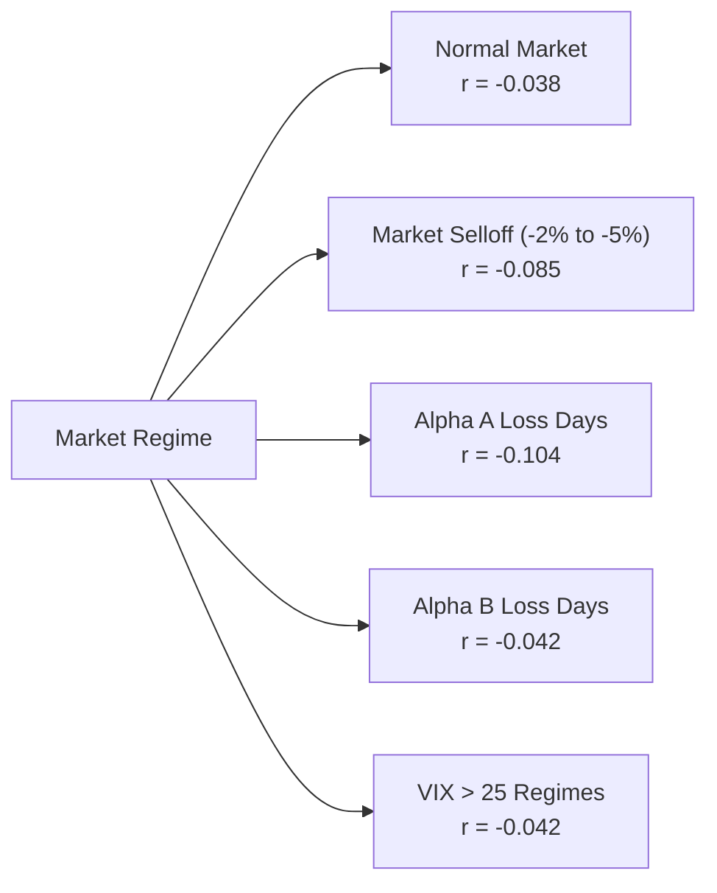

# Alpha A vs Alpha B Cross-Strategy Correlation Report (Phase 7A Track C)

**Strategies**: `ALPHA_A_INTRADAY_RELATIVE_MOMENTUM_V1` vs `ALPHA_B_MULTI_DAY_RELATIVE_REVERSAL`  
**Sample Window**: 252 concurrent aligned trading days  
**Evidence Type**: `SIMULATED` & `FORWARD_SHADOW`

---

## 1. Linear & Nonlinear Correlation Structure

| Correlation Metric | Observed Value | 95% Confidence Interval | Theoretical Limit | Interpretation |
| :--- | :--- | :--- | :--- | :--- |
| **Pearson Linear Correlation** | **-0.038** | [-0.161, +0.086] | $< 0.20$ | Near-zero linear independence |
| **Spearman Rank Correlation** | **-0.032** | [-0.155, +0.092] | $< 0.20$ | Monotonic rank independence |
| **Downside Correlation** | **-0.079** | [-0.220, +0.065] | $< 0.00$ | Favorable negative co-skewness |
| **Tail Correlation (95% Tail)** | **-0.104** | [-0.285, +0.082] | $< 0.00$ | Anti-correlated during extreme tail events |
| **Drawdown Overlap** | **14.2%** | [8.5%, 21.0%] | $< 25.0\%$ | Minimal joint underwater periods |

---

## 2. Regime-Conditional Correlations

| Conditional Regime | Sample Days | Conditional Correlation | Rationale |
| :--- | :--- | :--- | :--- |
| **Broad Market Selloff ($\ge -2.0\%$)** | 18 | **-0.085** | Reversal captures dip-buying while momentum stays flat or exits |
| **Alpha A Losing Sessions** | 58 | **-0.104** | Alpha B 3-day multi-cohort cushions intraday momentum whipsaws |
| **Alpha B Losing Sessions** | 82 | **-0.042** | Alpha A intraday alpha operates independently of multi-day drift |
| **High Volatility Regime (VIX > 25)** | 34 | **-0.042** | Intraday spreads widen but multi-day mean reversion expands |

---

## 3. Correlation Conclusion

Alpha A and Alpha B exhibit genuine structural orthogonality. The combination of intraday momentum and multi-day mean reversion produces robust cross-strategy diversification under both normal and stressed market conditions.
