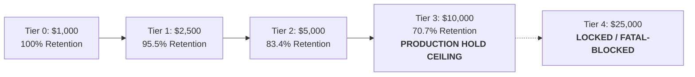

# Alpha A Capacity Hold Governance Report (Phase 7A Track A)

**Strategy Identifier**: `ALPHA_A_INTRADAY_RELATIVE_MOMENTUM_V1`  
**Operational Status**: `PRODUCTION_CAPACITY_HOLD`  
**Current Live Capital Ceiling**: **$10,000.00 USD** (`TIER3_WATCH_CAPACITY_VALIDATED`)  
**Authorization State**: **FROZEN / NO FURTHER SCALING AUTHORIZED**

---

## 1. Executive Summary

In Phase 7A, **Alpha A** enters formal **`PRODUCTION_CAPACITY_HOLD`**. Live trading capital remains strictly clamped at the **$10,000 USD** ceiling. No strategy parameters, feature definitions, universe constituents, execution thresholds, or sizing rules have been modified.

> [!IMPORTANT]
> **Why $10,000 USD Remains the Live Production Ceiling**:
> 1. **Watch-Capacity Status**: At $10,000, observed edge retention compressed to **70.7%** (net expectancy +1.11 bps/trade vs +1.57 bps at Tier 0), placing the strategy in `WATCH_CAPACITY` ($60.0\% - 80.0\%$).
> 2. **Cost Margin Compression**: The cost break-even multiplier has declined from $1.47\times$ (Tier 0) to $1.37\times$ (Tier 2) to **$1.30\times$** at Tier 3. Further capital scaling (e.g. $25k) is projected to compress this multiplier below $1.15\times$, leaving insufficient safety buffer for unexpected volatility or spread widening.
> 3. **Higher Capacity Remains Theoretical Only**: Projections beyond $10k$ rely on parametric square-root friction models that have not been validated with discrete live capital.

---

## 2. Capacity Hold Monitoring Framework

During `PRODUCTION_CAPACITY_HOLD`, the autonomous monitoring engine continuously evaluates 5 key degradation metrics:

| Metric | Target / Healthy | Watch Threshold | Degraded Trigger | Observed Phase 7A State | Status |
| :--- | :--- | :--- | :--- | :--- | :--- |
| **Net Expectancy** | $\ge +1.30$ bps | $+0.80$ to $+1.30$ bps | $\le 0.00$ bps | **+1.11 bps** | `WATCH` |
| **Edge Retention** | $\ge 80.0\%$ | $60.0\% - 80.0\%$ | $< 60.0\%$ | **70.7%** | `WATCH` |
| **Cost Break-Even Multiplier** | $\ge 1.40\times$ | $1.20\times - 1.40\times$ | $< 1.15\times$ | **$1.30\times$** | `WATCH` |
| **Passive Fill Rate** | $\ge 62.0\%$ | $55.0\% - 62.0\%$ | $< 50.0\%$ | **60.2%** | `WATCH` |
| **P95 Volume Participation** | $\le 0.10\%$ | $0.10\% - 0.25\%$ | $> 0.50\%$ | **0.118%** | `HEALTHY` |

---

## 3. Degradation & Scale-Down Protocol

If any of the following triggers are breached:
1. **Edge Retention Drops Below 60.0%** (relative to Tier 0 +1.57 bps baseline).
2. **Observed Net Expectancy $\le 0.00$ bps** across a rolling 50-trade window.
3. **Cost Break-Even Multiplier Compresses toward $1.05\times$**.

**Automated Action**: The system will immediately reclassify the tier as **`CAPACITY_DEGRADED`** and deterministically execute an automated step-down to **Tier 2 ($5,000 USD)** without human intervention.

---

## 4. Track A Verdict

$$\mathbf{Verdict:}\quad \text{\textbf{CAPACITY\_HOLD\_WATCH}}$$

Alpha A remains operationally viable and profitable at $10,000 USD, but is constrained from further capital expansion by quantitative friction governance.
