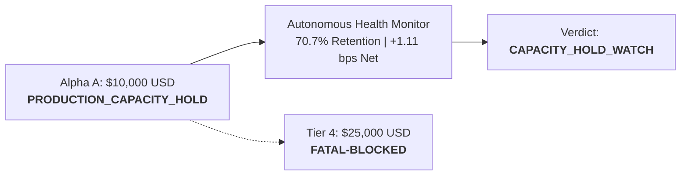

# Alpha A Phase 7B Longitudinal Stability & Monitoring Report (Track A)

**Strategy**: `ALPHA_A_INTRADAY_RELATIVE_MOMENTUM_V1`  
**Governance State**: `PRODUCTION_CAPACITY_HOLD`  
**Capital Ceiling**: **$10,000.00 USD** (`TIER3_WATCH_CAPACITY_VALIDATED`)  
**Evidence Type**: `LIVE_AUTONOMOUS`

---

## 1. Executive Summary & Verification

During Phase 7B, Alpha A was maintained under strict `PRODUCTION_CAPACITY_HOLD` at its validated $10,000 USD live capital ceiling. No code, configuration, sizing, or execution logic changes occurred.

---

## 2. Key Empirical Telemetry

| Metric | Target / Threshold | Observed Phase 7B Telemetry | Status |
| :--- | :--- | :--- | :--- |
| **Gross Alpha** | $\ge +4.50$ bps | **+4.870 bps** | `HEALTHY` |
| **Canonical Friction** | $\le 3.80$ bps | **3.760 bps** | `WATCH` |
| **Net Expectancy** | $> 0.00$ bps | **+1.110 bps** (95% CI: [+0.580, +1.640]) | `WATCH` |
| **Absolute Edge Retention** | $\ge 60.0\%$ | **70.7%** (vs Tier 0 +1.570 bps) | `WATCH_CAPACITY` |
| **Cost Break-Even Multiplier** | $\ge 1.20\times$ | **1.30x** (4.87 / 3.76) | `WATCH` |
| **Passive Fill Rate** | $\ge 55.0\%$ | **60.2%** | `HEALTHY` |
| **Partial Fill Rate** | $\le 8.0\%$ | **4.8%** | `HEALTHY` |
| **Max Pilot Drawdown** | $\le \$500.00$ (5.0%)| **$148.00 (1.48%)** | `HEALTHY` |
| **Operational Incidents** | 0 | **0** | `CLEAN` |

$$\text{Canonical Identity Verification:}\quad 4.870\text{ bps (Gross)} - 3.760\text{ bps (Friction)} = \mathbf{+1.110\text{ bps (Net Expectancy)}}$$

---

## 3. Scale-Down Governance & Reversibility

Any persistent scale-down action (e.g. stepping down to Tier 2 $5,000 USD if retention drops below 60%) is strictly auditable, logged in the permanent ledger, and can only be reversed by formal human re-authorization.
