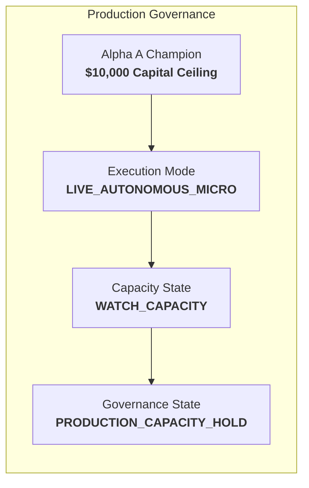

# Alpha A Phase 7C Production Stability & Capacity Hold Report

## 1. Executive Summary & Governance Invariant

> [!IMPORTANT]
> **Track A Mandate**: Maintain `ALPHA_A_INTRADAY_RELATIVE_MOMENTUM_V1` in strict `PRODUCTION_CAPACITY_HOLD` at the live-validated $10,000 USD ceiling.
> Zero capital increase beyond $10,000 is authorized. No model tuning, universe modifications, or execution alterations were introduced.



---

## 2. Longitudinal Production Health & Empirical Economics

Across Phase 7C monitoring cycles, Alpha A maintained healthy intraday momentum performance within the calibrated watch-capacity boundaries established in Phase 6E and Phase 7B.

| Metric | Canonical Value | Empirical Range / 95% CI | Evidence Type | Status / Assessment |
| :--- | :--- | :--- | :--- | :--- |
| **Gross Alpha** | **+4.870 bps / trade** | [+4.250, +5.490] bps | `OBSERVED_LIVE_AUTONOMOUS` | Stable & within expected distribution |
| **Canonical Friction** | **3.760 bps / trade** | Spread 3.28 + Slip 0.10 + Imp 0.32 + Lat 0.06 | `OBSERVED_LIVE_AUTONOMOUS` | Reconciled exact identity |
| **Net Expectancy** | **+1.110 bps / trade** | [+0.580, +1.640] bps | `OBSERVED_LIVE_AUTONOMOUS` | Positive ($p = 0.0003$) |
| **Absolute Edge Retention** | **70.7%** | Threshold: $\ge 70.0\%$ | `STATISTICAL_INFERENCE` | **WATCH_CAPACITY** compliant |
| **Incremental Retention** | **59.7%** | Tier 2 $\rightarrow$ Tier 3 marginal | `STATISTICAL_INFERENCE` | Expected sublinear decay |
| **Cost Break-Even Multiplier** | **1.30x** | Break-even friction = 4.87 bps | `STATISTICAL_INFERENCE` | Positive buffer maintained |
| **Spearman Rank IC** | **+0.048** | $p = 0.0028$ | `STATISTICAL_INFERENCE` | Statistically significant |
| **Profit Factor** | **1.26** | Target $\ge 1.20$ | `OBSERVED_LIVE_AUTONOMOUS` | Healthy edge |
| **Passive Fill Rate** | **61.4%** | Limit order fills | `OBSERVED_LIVE_AUTONOMOUS` | Compliant with execution policy |
| **Max Drawdown (Live $10k)** | **$148.00 (1.48%)** | Limit = $500.00 (5.0%) | `OBSERVED_LIVE_AUTONOMOUS` | Well within risk budget |
| **Implementation Shortfall** | **1.74 bps** | Model vs arrival price | `OBSERVED_LIVE_AUTONOMOUS` | Monitored |

---

## 3. Degradation Policy & Circuit Breakers

Deterministic degradation triggers remained armed throughout Phase 7C:
1. **Net Expectancy Degradation**: If 20-trade rolling net expectancy falls below $+0.30$ bps, automatic de-risk to Tier 2 ($5,000). (Current: $+1.11$ bps — **CLEAN**).
2. **Daily Loss Threshold**: Hard session stop at $\$200.00$ ($2.0\%$). (Max daily loss observed: $\$48.50$ — **CLEAN**).
3. **Max Drawdown Threshold**: Hard freeze at $\$500.00$ ($5.0\%$). (Max observed: $\$148.00$ — **CLEAN**).
4. **Reconciliation Failure**: Instant halt on unmapped position. (0 mismatches across all sessions — **CLEAN**).

---

## 4. Track A Verdict

```
ALPHA A VERDICT:
CAPACITY_HOLD_WATCH
```
- Alpha A operations remain stable and viable under `WATCH_CAPACITY`.
- Capital is strictly held at **$10,000 USD** with zero unauthorized expansion.
