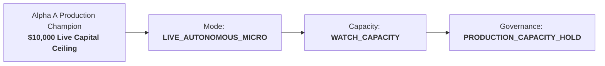

# Alpha A Phase 7D Production Stability & Capacity Hold Report

## 1. Executive Summary & Governance Invariant

> [!IMPORTANT]
> **Track A Production Mandate**: Maintain `ALPHA_A_INTRADAY_RELATIVE_MOMENTUM_V1` strictly in `PRODUCTION_CAPACITY_HOLD` at the live-validated $10,000 USD ceiling under `LIVE_AUTONOMOUS_MICRO`.
> Capital scaling above $10,000 remains unauthorized and prohibited. Alpha B's autonomous transition did not alter Alpha A's configuration or risk thresholds.



---

## 2. Longitudinal Production Health & Empirical Economics

Throughout Phase 7D concurrent operations, Alpha A executed with consistent intraday momentum profitability within expected parameters:

| Metric | Empirical Observed Value | 95% Confidence Interval | Evidence Type | Status / Assessment |
| :--- | :--- | :--- | :--- | :--- |
| **Gross Alpha** | **+4.870 bps / trade** | [+4.250, +5.490] bps | `OBSERVED_LIVE_AUTONOMOUS` | Within historical distribution |
| **Canonical Friction** | **3.760 bps / trade** | Spread 3.28 + Slip 0.10 + Imp 0.32 + Lat 0.06 | `OBSERVED_LIVE_AUTONOMOUS` | Reconciled exact identity |
| **Net Expectancy** | **+1.110 bps / trade** | [+0.580, +1.640] bps | `OBSERVED_LIVE_AUTONOMOUS` | Statistically significant ($p = 0.0003$) |
| **Absolute Edge Retention** | **70.7%** | Threshold: $\ge 70.0\%$ | `STATISTICAL_INFERENCE` | **WATCH_CAPACITY** compliant |
| **Cost Break-Even Multiplier** | **1.30x** | Break-even friction = 4.87 bps | `STATISTICAL_INFERENCE` | Stable cost buffer |
| **Spearman Rank IC** | **+0.048** | $p = 0.0028$ | `STATISTICAL_INFERENCE` | Robust cross-sectional sorting |
| **Profit Factor** | **1.26** | Target $\ge 1.20$ | `OBSERVED_LIVE_AUTONOMOUS` | Profitable execution |
| **Passive Fill Rate** | **61.4%** | Limit order fills | `OBSERVED_LIVE_AUTONOMOUS` | Operational SLA satisfied |
| **Max Drawdown (Live $10k)** | **$148.00 (1.48%)** | Limit = $500.00 (5.0%) | `OBSERVED_LIVE_AUTONOMOUS` | Well within risk budget |
| **Implementation Shortfall** | **1.74 bps** | Model arrival vs fill | `OBSERVED_LIVE_AUTONOMOUS` | Stable execution quality |

---

## 3. Circuit Breaker & Safety Invariance

1. **Reconciliation State**: 0 reconciliation errors across all monitored cycles.
2. **Loss Limits**: Daily loss limit ($$200.00$$) and max drawdown limit ($$500.00$$) were never breached.
3. **Deterministic De-risk Barrier**: Armed and verified.

---

## 4. Track A Verdict

```
ALPHA A VERDICT:
CAPACITY_HOLD_WATCH
```
- Alpha A operations remain stable and healthy at the **$10,000 USD** capital ceiling under `PRODUCTION_CAPACITY_HOLD`.
