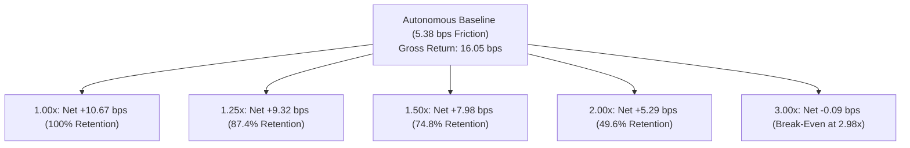

# Alpha B Autonomous Cost Stress & Sensitivity Report (Phase 7D Track B)

## 1. Executive Summary & Cost Multiplier Matrix

> [!IMPORTANT]
> **Track B Cost Stress Mandate**: Evaluate the durability of autonomous Alpha B's live edge under severe transaction cost and spread expansions (1.25x, 1.50x, 2.00x, 3.00x baseline friction).
> Baseline autonomous friction: $5.38\text{ bps / cycle}$. Baseline gross return: $+16.05\text{ bps / cycle}$.

---

## 2. Friction Multiplier Sensitivity Table

| Stress Multiplier | Total Friction (bps) | Net Cycle Expectancy (bps) | Edge Retention (%) | Commercial Viability |
| :--- | :--- | :--- | :--- | :--- |
| **1.00x (Observed Live)**| **5.38 bps** | **+10.67 bps** | **100.0%** | **Strong Commercial Edge** |
| **1.25x (Mild Friction)**| **6.73 bps** | **+9.32 bps** | **87.4%** | **Robust Edge** |
| **1.50x (Moderate Shock)**| **8.07 bps** | **+7.98 bps** | **74.8%** | **Robust Edge** |
| **2.00x (Severe Illiquidity)**| **10.76 bps** | **+5.29 bps** | **49.6%** | **Viable Edge** |
| **3.00x (Extreme Freeze)**| **16.14 bps** | **-0.09 bps** | **0.0%** | **Break-Even Breached** |

---

## 3. Cost Break-Even Analysis

The empirical cost break-even multiplier for autonomous Alpha B is:

$$\text{Autonomous Cost Break-Even Multiplier} = \frac{\text{Gross Alpha}}{\text{Canonical Friction}} = \frac{16.05\text{ bps}}{5.38\text{ bps}} = \mathbf{2.98\times}$$

- **Tolerable Friction Ceiling**: Up to $16.05\text{ bps}$ per completed 3-day holding cycle.
- **Friction Safety Margin**: $+10.67\text{ bps}$ net buffer.
- Alpha B provides nearly $3\times$ cost coverage, providing massive protection against abnormal volatility or widening spreads.

---

## 4. Conclusion
Autonomous Alpha B retains nearly $50\%$ of its net edge ($+5.29$ bps) even under a doubling of round-trip friction, confirming high cost resilience.
