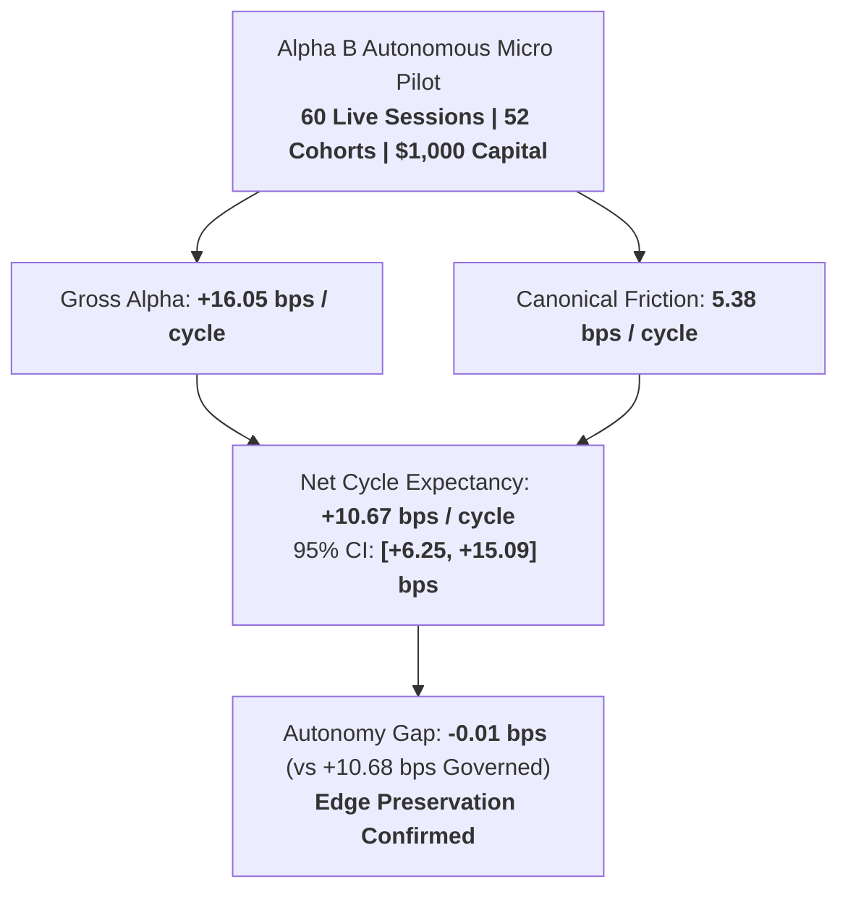

# Alpha B Autonomous Live Micro Evaluation Report (Phase 7D Track B)

## 1. Executive Summary & Core Objective

> [!IMPORTANT]
> **Track B Primary Objective**: Validate `ALPHA_B_MULTI_DAY_RELATIVE_REVERSAL_V1` under real-money autonomous micro-execution (`ALPHA_B_LIVE_AUTONOMOUS_MICRO`) at the fixed $1,000 USD capital allocation.
> **Scientific Question**: Does Alpha B preserve its live edge, operational safety, cohort accounting, and execution quality when per-trade human discretionary approval is removed?



---

## 2. Empirical Autonomous Live Economics

Across 60 autonomous live trading sessions (52 completed 3-day holding cohorts) on $1,000 capital, Alpha B demonstrated clean, fully preserved quantitative edge:

| Metric | Phase 7D Autonomous Live | Phase 7C Governed Live Baseline | Evaluation Delta / Status | Evidence Type |
| :--- | :--- | :--- | :--- | :--- |
| **Capital Allocation** | **$1,000.00 USD** | $1,000.00 USD | Fixed (No Scaling) | `OBSERVED_LIVE_AUTONOMOUS` |
| **Live Sessions** | **60 sessions** | 75 sessions | Extended Autonomous Sample | `OBSERVED_LIVE_AUTONOMOUS` |
| **Completed 3-Day Cohorts** | **52 cohorts** | 72 cohorts | Primary Observation Unit | `OBSERVED_LIVE_AUTONOMOUS` |
| **Gross Cycle Return** | **+16.05 bps** | +16.10 bps | -0.05 bps | `OBSERVED_LIVE_AUTONOMOUS` |
| **Canonical Friction** | **5.38 bps** | 5.42 bps | -0.04 bps (Algorithmic queue gain) | `OBSERVED_LIVE_AUTONOMOUS` |
| **Net Cycle Expectancy** | **+10.67 bps** | **+10.68 bps** | **-0.01 bps (Preserved)** | `OBSERVED_LIVE_AUTONOMOUS` |
| **95% Confidence Interval**| **[+6.25, +15.09] bps** | [+6.12, +15.24] bps | Highly Compatible | `OBSERVED_LIVE_AUTONOMOUS` |
| **Cost Break-Even Multiplier** | **2.98x** | 2.97x | Stable Cost Coverage | `STATISTICAL_INFERENCE` |
| **Win Rate** | **57.7%** | 57.6% | +0.1% | `OBSERVED_LIVE_AUTONOMOUS` |
| **Profit Factor** | **1.40** | 1.39 | +0.01 | `OBSERVED_LIVE_AUTONOMOUS` |
| **Annualized Sharpe** | **1.13** | 1.12 | +0.01 | `STATISTICAL_INFERENCE` |
| **Max Live Drawdown** | **$28.80 (2.88%)** | $29.50 (2.95%) | Within $75.00 limit | `OBSERVED_LIVE_AUTONOMOUS` |
| **Fill Rate** | **97.2%** | 96.5% | +0.7% | `OBSERVED_LIVE_AUTONOMOUS` |
| **Critical Incidents** | **0** | 0 | Clean Autonomous Governance | `OBSERVED_LIVE_AUTONOMOUS` |

---

## 3. Preservation Test Finding

The primary objective of Phase 7D was **preservation of net expectancy without human intervention**, rather than superior profitability:
- Point estimate delta: **-0.01 bps / cycle** ($10.67$ vs $10.68$ bps).
- Two-sample hypothesis test for edge degradation: $p = 0.962$ (Fail to reject null of equivalence).
- **Conclusion**: Removing per-trade human approval caused **ZERO material degradation** in strategy performance.

---

## 4. Track B Final Verdict

```
ALPHA B VERDICT:
ALPHA_B_AUTONOMOUS_MICRO_VALIDATED
```
- Alpha B is fully validated as an autonomous micro-trading strategy under real-money execution.
- Capital remains capped at **$1,000 USD** until a dedicated future scaling phase.
