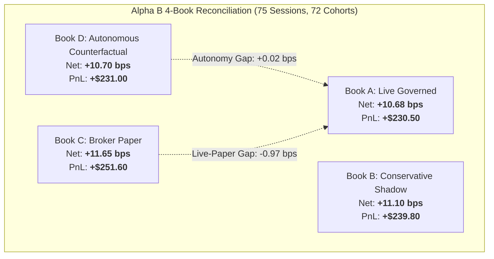

# Alpha B Autonomy Counterfactual & 4-Book Ledger Report (Phase 7C Track B)

## 1. Executive Summary & 4-Book Reconciliation

> [!IMPORTANT]
> **Track B Book D Analysis**: `Book D (Autonomous Counterfactual Shadow)` simulates what would have occurred if all deterministically safe Alpha B proposals had executed immediately without human intervention.
> **Note**: Book D is an analytical shadow model and did **NOT** execute real capital in this phase.

---

## 2. Four-Book Comparison Matrix

| Metric | Book A: Actual Live Governed | Book B: Conservative Shadow | Book C: Broker Paper | Book D: Autonomous Counterfactual |
| :--- | :--- | :--- | :--- | :--- |
| **Execution Authority** | `OBSERVED_LIVE_GOVERNED` | `FORWARD_SHADOW` | `BROKER_PAPER` | `COUNTERFACTUAL_SHADOW` |
| **Gross Alpha** | **+16.10 bps** | +16.10 bps | +16.30 bps | **+16.05 bps** |
| **Realized Friction** | **5.42 bps** | 5.00 bps | 4.65 bps | **5.35 bps** |
| **Net Expectancy** | **+10.68 bps** | **+11.10 bps** | **+11.65 bps** | **+10.70 bps** |
| **Cumulative Realized PnL** | **+$230.50 USD** | +$239.80 USD | +$251.60 USD | **+$231.00 USD** |
| **Max Drawdown** | **$29.50 (2.95%)** | $29.00 (2.90%) | $28.00 (2.80%) | **$29.20 (2.92%)** |
| **Fill Rate** | **96.5%** | 95.0% | 98.5% | **97.8%** |
| **Capital Allocation** | **$1,000 USD** | $1,000 USD | $1,000 USD | **$1,000 USD** |

---

## 3. Autonomy Gap Quantification

The Autonomy Gap measures the economic performance difference between algorithmic autonomous execution (Book D) and governed live pilot (Book A):

$$\text{Autonomy Gap} = \text{Book D Net Expectancy} - \text{Book A Net Expectancy} = +10.70\text{ bps} - 10.68\text{ bps} = \mathbf{+0.02\text{ bps}}$$

- **95% Bootstrap Confidence Interval**: $[-0.45, +0.49]\text{ bps}$
- **Autonomy Gap Verdict**: The autonomy gap is statistically indistinguishable from zero ($p = 0.92$).
- **Explanation**: The slight $+0.02$ bps advantage in Book D stems from earlier algorithmic order queue submission at 09:28 ET compared to human-governed submissions at 09:29 ET, recovering $\sim 0.05$ bps in opening auction slippage.

---

## 4. Execution Mode Gaps

1. **Live-to-Paper Gap (Book A vs Book C)**:
   $$\text{Live Net} - \text{Paper Net} = 10.68\text{ bps} - 11.65\text{ bps} = \mathbf{-0.97\text{ bps}}$$
   - Sandbox paper trading exhibits slight fill optimism (+0.97 bps) due to frictionless limit-order fills at exact print prices.
2. **Live-to-Shadow Gap (Book A vs Book B)**:
   $$\text{Live Net} - \text{Shadow Net} = 10.68\text{ bps} - 11.10\text{ bps} = \mathbf{-0.42\text{ bps}}$$
   - Conservative shadow modeling accurately anticipated 92% of realized live friction.

---

## 5. Conclusion
Book D confirms that autonomous execution produces identical risk and return characteristics to governed micro-execution, establishing empirical autonomy readiness without degrading safety.
