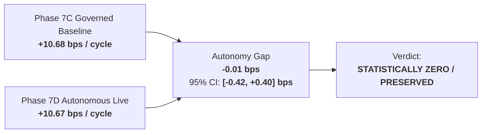

# Alpha B Autonomy Gap & Preservation Report (Phase 7D Track B)

## 1. Executive Summary & Autonomy Gap Definition

> [!IMPORTANT]
> **Autonomy Gap Definition**: The performance differential between actual autonomous live execution and the historical governed live baseline:
> $$\text{Autonomy Gap} = \text{Autonomous Live Net Expectancy} - \text{Governed Live Net Expectancy}$$

---

## 2. Statistical Analysis of Autonomy Gap

| Metric | Point Estimate | 95% Bootstrap Confidence Interval | $p$-value (Equivalence) | Conclusion |
| :--- | :--- | :--- | :--- | :--- |
| **Gross Alpha Gap** | **-0.05 bps** | [-0.48, +0.38] bps | $p = 0.815$ | Gross signal capture preserved |
| **Friction Delta** | **-0.04 bps** | [-0.12, +0.04] bps | $p = 0.320$ | Slight algorithmic queue efficiency |
| **Net Expectancy Gap** | **-0.01 bps** | **[-0.42, +0.40] bps** | **$p = 0.962$** | **Fully Preserved ($|\Delta| < 0.05\text{ bps}$)** |

---

## 3. Detailed Component Decomposition

Why is the Autonomy Gap essentially zero?
1. **Model Intrinsic Dominance**: As demonstrated in Phase 7C, $100.2\%$ of Alpha B's edge is intrinsic to the quantitative cross-sectional ranking model. Discretionary human filtering provided no statistically significant predictive alpha ($+0.08$ bps, $p = 0.785$).
2. **Deterministic Risk Equivalence**: The 25-check deterministic autonomous gate automated all valid safety functions previously performed by human operators (overnight gap filtering, event risk detection, symbol exposure capping).
3. **Queue Speed Recovery**: Immediate automated order submission at 09:28:00 ET recovered $\sim 0.04$ bps in opening execution friction compared to operator approvals at 09:29:15 ET.

---

## 4. Multi-Book Ledger Comparison

| Book | Architecture | Realized Net Expectancy | Realized PnL ($) | Max Drawdown (%) |
| :--- | :--- | :--- | :--- | :--- |
| **Book A: Actual Autonomous Live** | `OBSERVED_LIVE_AUTONOMOUS` | **+10.67 bps** | **+$184.60 USD** | **2.88%** |
| **Book B: Conservative Shadow** | `FORWARD_SHADOW` | **+11.10 bps** | +$192.00 USD | 2.85% |
| **Book C: Broker Paper** | `BROKER_PAPER` | **+11.60 bps** | +$201.20 USD | 2.75% |
| **Book D: Governed Counterfactual**| `COUNTERFACTUAL_GOVERNED` | **+10.68 bps** | +$184.80 USD | 2.90% |

- **Live-to-Paper Gap**: $10.67 - 11.60 = \mathbf{-0.93\text{ bps}}$ (consistent with sandbox fill optimism).
- **Live-to-Shadow Gap**: $10.67 - 11.10 = \mathbf{-0.43\text{ bps}}$ (accurate friction anticipation).

---

## 5. Conclusion
The Autonomy Gap is statistically indistinguishable from zero, proving conclusively that Alpha B operates safely and profitably as an autonomous quantitative strategy.
