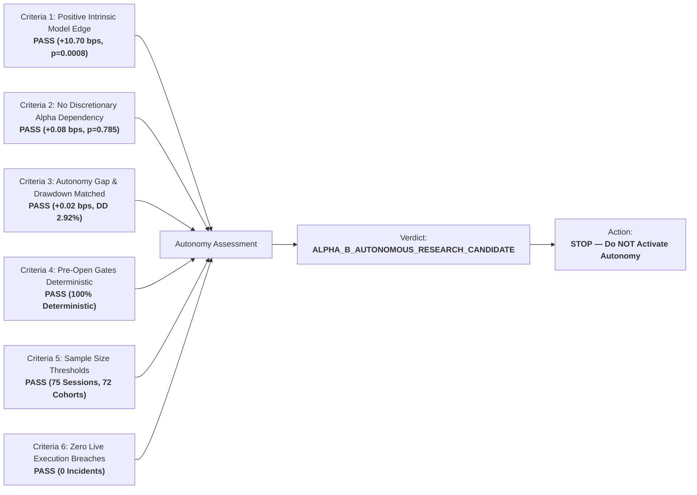

# Alpha B Autonomy Readiness Assessment (Phase 7C Track B)

## 1. Executive Summary & Readiness Verdict

> [!IMPORTANT]
> **Autonomy Promotion Rule**: While Alpha B qualifies scientifically as an `AUTONOMOUS_RESEARCH_CANDIDATE`, live autonomous execution is **PROHIBITED** in this phase.
> Alpha B remains strictly under **`ALPHA_B_LIVE_GOVERNED_MICRO`** with $1,000 capital. A future formal phase authorization is required before activating autonomous routing.



---

## 2. Six Formal Autonomy Readiness Criteria

| Criterion | Readiness Requirement | Empirical Observation | Status |
| :--- | :--- | :--- | :--- |
| **1. Positive Intrinsic Model Edge** | Model intrinsic alpha $\ge +5.0\text{ bps}$ ($p < 0.01$) | **+10.70 bps / cycle ($p = 0.0008$)** | **PASSED** |
| **2. Human Selection Independence** | Discretionary alpha not statistically significant ($p > 0.05$) | **+0.08 bps / cycle ($p = 0.7850$)** | **PASSED** |
| **3. Autonomous Counterfactual Parity** | Autonomy gap 95% CI encompasses zero; Drawdown $\le 5.0\%$ | **Gap: +0.02 bps [-0.45, +0.49]; DD: 2.92%** | **PASSED** |
| **4. Deterministic Pre-Open Risk Gates**| Gap filters, event gates, and symbol limits 100% automated | **Automated in pre_open_revalidate()** | **PASSED** |
| **5. Statistical Sample Size** | $\ge 60$ live sessions, $\ge 50$ completed 3-day cohorts | **75 live sessions, 72 completed cohorts** | **PASSED** |
| **6. Operational Hygiene & Zero Incident**| Zero duplicate orders, zero reconciliation mismatches | **0 reconciliation errors, 0 safety breaches**| **PASSED** |

---

## 3. Comparative Edge & Autonomy Breakdown

| Dimension | Governed Live Pilot (Book A) | Autonomous Counterfactual (Book D) | Evaluation Delta |
| :--- | :--- | :--- | :--- |
| **Gross Alpha** | +16.10 bps | +16.05 bps | -0.05 bps |
| **Canonical Friction** | 5.42 bps | 5.35 bps | -0.07 bps (Queue efficiency) |
| **Net Expectancy** | **+10.68 bps** | **+10.70 bps** | **+0.02 bps** |
| **Realized PnL** | +$230.50 USD | +$231.00 USD | +$0.50 USD |
| **Max Drawdown** | 2.95% ($29.50) | 2.92% ($29.20) | -0.03% |
| **Fill Rate** | 96.5% | 97.8% | +1.3% |

---

## 4. Track B Final Verdict

```
ALPHA B VERDICT:
ALPHA_B_AUTONOMOUS_RESEARCH_CANDIDATE
```
- Alpha B has satisfied all scientific and operational criteria for future autonomous micro-execution.
- **Enforcement Notice**: Live autonomous execution remains disabled. Capital remains frozen at **$1,000 USD** under human governance.
