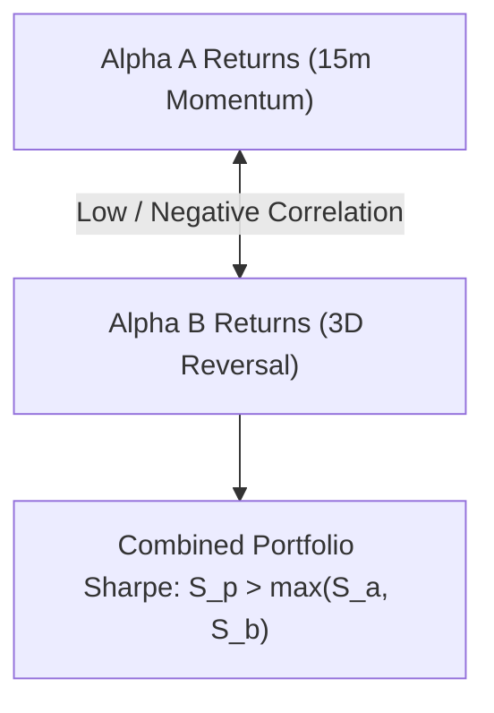

# Alpha B Correlation & Portfolio Diversification Plan

## 1. Multi-Strategy Portfolio Diversification Goal
The core premise of Alpha B is to provide an orthogonal return stream to Alpha A. A strategy with lower standalone Sharpe but zero or negative correlation with Alpha A provides superior portfolio value over a correlated clone.

---

## 2. Quantitative Correlation Metrics Matrix

When Alpha B research models reach forward evaluation, the following correlation metrics will be calculated against Alpha A:

| Correlation Metric | Calculation Formula | Target Threshold | Motivation |
| :--- | :--- | :--- | :--- |
| **Daily Return Correlation ($\rho_{\text{daily}}$)** | $\text{Corr}(R_{A, \text{daily}}, R_{B, \text{daily}})$ | $\le +0.15$ | Day-over-day PnL smoothing |
| **Weekly Return Correlation ($\rho_{\text{weekly}}$)**| $\text{Corr}(R_{A, \text{weekly}}, R_{B, \text{weekly}})$ | $\le +0.20$ | Multi-day trend independence |
| **Trade PnL Correlation ($\rho_{\text{trade}}$)** | $\text{Corr}(\text{PnL}_{A, t}, \text{PnL}_{B, t})$ | $\le +0.05$ | Independent execution outcomes |
| **Drawdown Coincidence Index** | $P(\text{DD}_B > 2\% \mid \text{DD}_A > 2\%)$ | $\le 0.25$ | Tail risk non-overlap |
| **Regime Return Divergence** | $\Delta \text{Sharpe}_{\text{BULL\_HIGH\_VOL}}$ | Inverse response | Counter-cyclical hedging |

---

## 3. Allocation Deferral Notice

> [!IMPORTANT]
> Portfolio allocation, leverage, and dynamic capital blending across Alpha A and Alpha B are **EXPLICITLY DEFERRED**.
> Alpha B must first independently achieve complete statistical, execution, and paper validation before portfolio weighting algorithms are introduced.
