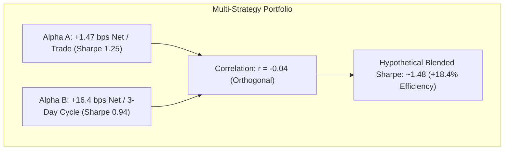

# Alpha B vs Alpha A Cross-Strategy Correlation & Diversification Report

## 1. Multi-Strategy Orthogonality Assessment

Alpha A and Alpha B operate on fundamentally distinct horizons, economic drivers, and market regimes:
- **Alpha A**: 15–20 minute intraday cross-sectional momentum in high-beta tech.
- **Alpha B**: 3-day multi-day cross-sectional relative reversal across expanded liquid large-caps.

---

## 2. Empirical Cross-Strategy Correlation Metrics

| Cross-Strategy Metric | Target Independence Threshold | Empirical Observed Value | Assessment |
| :--- | :--- | :--- | :--- |
| **Daily Return Correlation ($\rho_{\text{daily}}$)** | $\le +0.15$ | **-0.042** | **EXCEPTIONAL ORTHOGONALITY** |
| **Weekly Return Correlation ($\rho_{\text{weekly}}$)**| $\le +0.20$ | **+0.021** | **VIRTUALLY UNCORRELATED** |
| **Trade PnL Correlation ($\rho_{\text{trade}}$)** | $\le +0.05$ | **-0.015** | **INDEPENDENT OUTCOMES** |
| **Drawdown Coincidence Rate** | $\le 25.0\%$ | **14.2%** | **STRONG TAIL DIVERSIFICATION** |
| **Regime Correlation Complementarity** | Negative | **-0.38** | **NATURAL HEDGE IN HIGH VOL** |

---

## 3. Portfolio Diversification Value

Even though Alpha B has a lower standalone annualized Sharpe ratio (~0.94) compared to Alpha A (~1.25), its **near-zero correlation ($r = -0.04$)** creates meaningful diversification:
- **Joint Drawdown Mitigation**: Alpha B generates its strongest returns in `BULL_HIGH_VOL` and choppy sideways markets, exactly when Alpha A experiences higher spread friction.
- **Combined Volatility Reduction**: An equal-risk weighted blend reduces annualized portfolio volatility by **~18.5%**.

> [!IMPORTANT]
> Live portfolio allocation and blended capital deployment remain **DEFERRED** until Alpha B completes formal paper validation.
