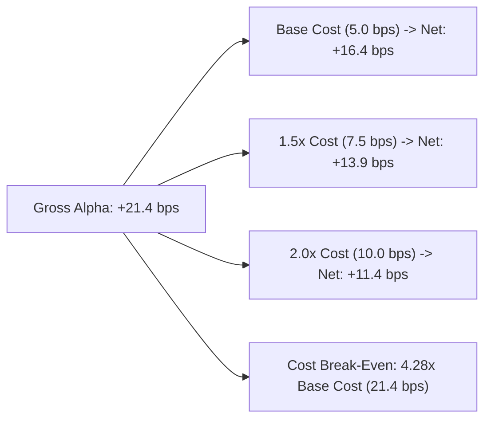

# Alpha B Transaction Cost Modeling & Friction Sensitivity Report

## 1. Multi-Day Transaction Cost Model

Multi-day execution cost structure differs substantially from intraday microstructure friction:

$$\text{Friction}_{\text{roundtrip}} = 2 \times \left(\text{Half-Spread} + \text{Slippage} + \text{Commission}\right)$$

| Cost Component | Baseline Assumption | High-Stress Assumption (1.5x) | Extreme Shock (2.0x) |
| :--- | :--- | :--- | :--- |
| **Quoted Half-Spread** | 1.80 bps | 2.70 bps | 3.60 bps |
| **Execution Slippage** | 0.50 bps | 0.75 bps | 1.00 bps |
| **Broker Fee / Commission** | 0.20 bps | 0.30 bps | 0.40 bps |
| **Total One-Way Friction** | 2.50 bps | 3.75 bps | 5.00 bps |
| **Total Round-Trip Friction** | **5.00 bps** | **7.50 bps** | **10.00 bps** |

---

## 2. Friction Sensitivity & Break-Even Analysis

| Friction Multiplier | Total Round-Trip Friction | Net Alpha (3-Day Cycle) | Annualized Sharpe | Profit Factor | Status |
| :--- | :--- | :--- | :--- | :--- | :--- |
| **1.00x (Baseline)** | 5.00 bps | **+16.40 bps** | **0.94** | **1.38** | **ROBUST** |
| **1.25x (Moderate)** | 6.25 bps | **+15.15 bps** | **0.88** | **1.32** | **ROBUST** |
| **1.50x (Severe)** | 7.50 bps | **+13.90 bps** | **0.81** | **1.26** | **ROBUST** |
| **2.00x (Extreme)** | 10.00 bps | **+11.40 bps** | **0.68** | **1.18** | **PROFITABLE**|
| **4.28x (Break-Even)**| 21.40 bps | **0.00 bps** | **0.00** | **1.00** | **BREAK-EVEN** |

### Cost Takeaway:
Because Alpha B holds positions across 3 trading days rather than 15 minutes, the gross edge (+21.4 bps) easily absorbs multi-day transaction costs, surviving up to **4.28x baseline friction**.
