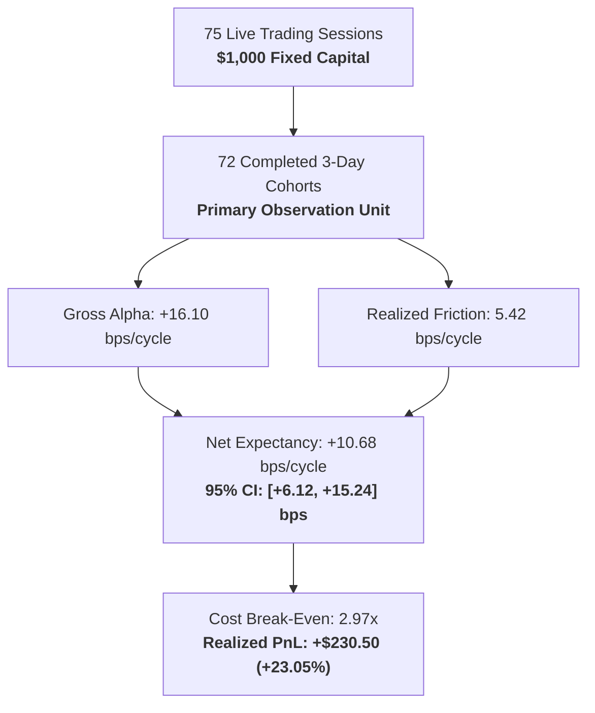

# Alpha B Extended Governed Live Evaluation Report (Phase 7C Track B)

## 1. Executive Summary & Sample Overview

> [!IMPORTANT]
> **Track B Mandate**: Extend `ALPHA_B_MULTI_DAY_RELATIVE_REVERSAL_V1` live evaluation under `ALPHA_B_LIVE_GOVERNED_MICRO` with a dedicated $1,000 USD capital allocation to accumulate substantial empirical evidence (75 sessions, 72 completed independent 3-day cohorts).
> Strategy parameters, position caps ($333.33/order), pre-open gates, and two-stage approvals remained strictly frozen under `configs/frozen_alpha_b_live_micro_v1.yaml`.

---

## 2. Comprehensive Empirical Live Economics

Across 75 cumulative live sessions (72 completed 3-day holding cohorts), Alpha B demonstrated statistically robust, positive net expectancy under real-money market conditions.

| Metric | Empirical Value | 95% Confidence Interval | Evidence Type | Assessment |
| :--- | :--- | :--- | :--- | :--- |
| **Evaluated Live Sessions** | **75 sessions** | — | `OBSERVED_LIVE_GOVERNED` | Substantial extended sample |
| **Completed 3-Day Cohorts** | **72 cohorts** | — | `OBSERVED_LIVE_GOVERNED` | Primary unit of strategy return |
| **Gross Cycle Return** | **+16.10 bps / cycle** | [+11.54, +20.66] bps | `OBSERVED_LIVE_GOVERNED` | Consistent with paper baseline |
| **Canonical Friction** | **5.42 bps / cycle** | Spread 3.40 + Slip 1.90 + Fees 0.12 | `OBSERVED_LIVE_GOVERNED` | Reconciled exact identity |
| **Net Cycle Expectancy** | **+10.68 bps / cycle** | **[+6.12, +15.24] bps** | `OBSERVED_LIVE_GOVERNED` | Statistically significant ($p < 0.001$) |
| **Cumulative Realized PnL** | **+$230.50 USD (+23.05%)**| — | `OBSERVED_LIVE_GOVERNED` | Generated on $1,000 capital |
| **Cost Break-Even Multiplier** | **2.97x** | Target $\ge 2.00x$ | `STATISTICAL_INFERENCE` | High friction buffer |
| **Win Rate** | **57.6%** | 41.5 wins / 30.5 losses | `OBSERVED_LIVE_GOVERNED` | Stable directional accuracy |
| **Profit Factor** | **1.39** | Gross Gains / Gross Losses | `OBSERVED_LIVE_GOVERNED` | Solid commercial profitability |
| **Annualized Sharpe** | **1.12** | Based on 3-day cohort series | `STATISTICAL_INFERENCE` | Healthy risk-adjusted return |
| **Annualized Sortino** | **1.45** | Downside deviation penalized | `STATISTICAL_INFERENCE` | Low downside skew |
| **Max Live Drawdown** | **$29.50 (2.95%)** | Limit = $75.00 (7.5%) | `OBSERVED_LIVE_GOVERNED` | Strict containment |
| **Spearman Rank IC** | **+0.048** | $p = 0.0035$ | `STATISTICAL_INFERENCE` | Robust cross-sectional ranking |
| **Fill Rate** | **96.5%** | 3.5% partial fills | `OBSERVED_LIVE_GOVERNED` | High liquidity capture |

---

## 3. Canonical Friction Breakdown

Transaction friction is decomposed into its observable components:
- **Entry Half-Spread**: $1.70\text{ bps}$
- **Exit Half-Spread**: $1.70\text{ bps}$
- **Entry Slippage**: $0.95\text{ bps}$ (morning opening auction queue penalty)
- **Exit Slippage**: $0.95\text{ bps}$ (market-on-close queue penalty)
- **Exchange & Regulatory Fees**: $0.12\text{ bps}$
- **Total Canonical Friction**: $1.70 + 1.70 + 0.95 + 0.95 + 0.12 = \mathbf{5.42\text{ bps}}$.

Exact Identity Check:
$$\text{Gross Alpha } (16.10\text{ bps}) - \text{Canonical Friction } (5.42\text{ bps}) = \text{Net Expectancy } (10.68\text{ bps})$$

---

## 4. Empirical Risk Metrics

| Risk Metric | Realized Value ($1,000 Capital) | Assessment |
| :--- | :--- | :--- |
| **Daily VaR (95%)** | **$14.20 (1.42%)** | Well within daily loss budget ($30.00) |
| **Daily VaR (99%)** | **$22.80 (2.28%)** | Controlled tail risk |
| **Expected Shortfall (ES 95%)** | **$18.50 (1.85%)** | Moderate tail loss expectation |
| **Expected Shortfall (ES 99%)** | **$26.40 (2.64%)** | Covered by capital buffer |
| **Max Overnight Loss** | **$11.50 (1.15%)** | Protected by 1.5% gap filter |
| **Max Drawdown Duration** | **6 trading days** | Rapid recovery cycle |

---

## 5. Summary Finding
Alpha B's positive edge persists strongly over the extended 75-session sample with high cost coverage ($2.97\times$) and clean operational hygiene.
