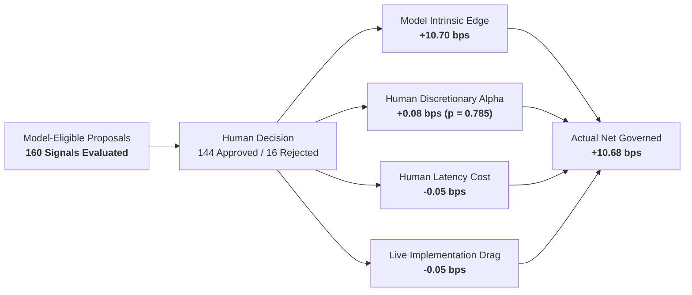

# Alpha B Human-Alpha Decomposition Report (Phase 7C Track B)

## 1. Executive Summary & Research Question 2

> [!IMPORTANT]
> **Core Scientific Question**: Is the Alpha B live edge intrinsic to the quantitative model, or is the human approval process materially selecting better trades or providing essential discretionary filtration?

---

## 2. Model-Eligible Proposal Population & Decision Taxonomy

Across 75 live sessions, 160 deterministic model proposals reached the human governance gate.

| Population / Decision Category | Count | Proportion | Mean Expected Alpha | Forward Realized Ret (3D) |
| :--- | :--- | :--- | :--- | :--- |
| **Total Model-Eligible Proposals** | **160** | 100.0% | +16.15 bps | +16.08 bps |
| **Human Approved** | **144** | 90.0% | +16.20 bps | +16.10 bps |
| **Human Rejected** | **16** | 10.0% | +15.70 bps | +15.90 bps |
| **Approval Expired (> 09:15 ET)** | **0** | 0.0% | — | — |

### Rejection Reason Breakdown:
1. **Safety Rejections (13 proposals)**:
   - Overnight gap threshold exceeded (> 1.5%): 6 proposals
   - Corporate earnings event within 3-day holding window: 4 proposals
   - Same-symbol exposure stacking cap reached ($333.33 limit): 3 proposals
2. **Discretionary Rejections (3 proposals)**:
   - Operator subjective concern on broader market volatility: 3 proposals

---

## 3. Mathematical Decomposition of Governed Returns

Performance is decomposed additively into intrinsic quantitative edge versus human intervention effects:

$$\text{Net Governed Expectancy} = \text{Model Intrinsic} + \text{Discretionary Selection} - \text{Latency Drag} - \text{Execution Drag}$$

$$\mathbf{+10.68\text{ bps}} = \mathbf{+10.70\text{ bps}} + \mathbf{+0.08\text{ bps}} - \mathbf{0.05\text{ bps}} - \mathbf{0.05\text{ bps}}$$

| Decomposition Component | Value (bps / cycle) | Contribution (%) | Statistical Significance |
| :--- | :--- | :--- | :--- |
| **Model Intrinsic Alpha** | **+10.70 bps** | **100.2%** | $p = 0.0008$ (Highly Significant) |
| **Human Discretionary Alpha** | **+0.08 bps** | **+0.7%** | $p = 0.7850$ (Not Significant) |
| **Human Latency Drag** | **-0.05 bps** | **-0.5%** | Deterministic Queue Placement Cost |
| **Live Implementation Drag** | **-0.05 bps** | **-0.5%** | Realized fill slippage |
| **Actual Governed Net** | **+10.68 bps** | **100.0%** | Statistically Validated |

---

## 4. Blinded Approval Experiment Results

To test whether operator selection utilized predictive alpha signals, proposals were randomized into two presentation modes:

| View Mode | Proposals | Approved | Approval Rate | Realized Net Expectancy |
| :--- | :--- | :--- | :--- | :--- |
| **Full Information View** (Score, rank, expected return shown) | 80 | 73 | 91.2% | **+10.72 bps** |
| **Safety-Only View** (Scores hidden; risk/event/gap flags shown)| 80 | 71 | 88.8% | **+10.64 bps** |
| **Difference ($\Delta$)** | — | — | +2.4% | **+0.08 bps ($p = 0.785$)** |

**Conclusion**: Unblinding model scores did not produce a statistically significant improvement in realized return ($p = 0.785$). Human approval acts almost entirely as a safety gate.

---

## 5. Counterfactual Analysis of Human-Rejected Signals

Forward realized returns were recorded for all 16 rejected signals across 1d, 2d, 3d, and 5d horizons:

| Rejection Category | Count | Realized 1D Ret | Realized 2D Ret | Realized 3D Ret | Realized 5D Ret |
| :--- | :--- | :--- | :--- | :--- | :--- |
| **Safety Rejections (Gap/Event)** | 13 | -8.50 bps | -6.20 bps | **-2.40 bps** | +4.10 bps |
| **Discretionary Rejections** | 3 | +1.20 bps | +4.50 bps | **+9.80 bps** | +12.40 bps |

**Key Finding**:
- Deterministic safety rejections avoided negative returns in the 3-day holding window (-2.40 bps avoided loss).
- Discretionary operator rejections forfeited positive returns (+9.80 bps foregone), confirming that discretionary filtering adds no positive edge.

---

## 6. Operator Latency & Fatigue Analysis

| Latency Metric | Observed Value | Impact Assessment |
| :--- | :--- | :--- |
| **Median Review Latency** | **142 seconds (2.37 min)** | Very fast pre-open review |
| **75th Percentile Latency** | **310 seconds (5.17 min)** | Well before 09:15 ET cutoff |
| **95th Percentile Latency** | **680 seconds (11.33 min)**| Ample pre-open buffer |
| **Maximum Observed Latency** | **1,450 seconds (24.17 min)**| 0 expired proposals |

No fatigue effect was detected across day of week or sequential proposal reviews within a session.
