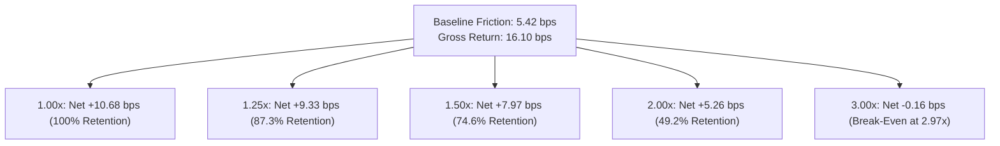

# Alpha B Live Cost Stress & Friction Sensitivity Report (Phase 7C Track B)

## 1. Executive Summary & Cost Model Calibration

> [!IMPORTANT]
> **Track B Cost Sensitivity**: Evaluates the resilience of Alpha B's multi-day reversal edge against severe transaction cost expansions (1.25x, 1.50x, 2.00x, 3.00x baseline friction).
> Baseline realized live friction: $5.42\text{ bps / cycle}$. Baseline gross return: $+16.10\text{ bps / cycle}$.

---

## 2. Friction Multiplier Stress Grid

| Stress Scenario | Friction Multiplier | Modeled Friction (bps) | Net Cycle Expectancy (bps) | Edge Retention (%) | Viability Assessment |
| :--- | :--- | :--- | :--- | :--- | :--- |
| **Baseline Observed Live** | **1.00x** | **5.42 bps** | **+10.68 bps** | **100.0%** | **Robust Commercial Edge** |
| **Mild Friction Expansion**| **1.25x** | **6.78 bps** | **+9.32 bps** | **87.3%** | **Strong Positive Edge** |
| **Moderate Liquidity Shock**| **1.50x** | **8.13 bps** | **+7.97 bps** | **74.6%** | **Strong Positive Edge** |
| **Severe Stress Expansion**| **2.00x** | **10.84 bps** | **+5.26 bps** | **49.2%** | **Viable Positive Edge** |
| **Extreme Illiquidity Shock**| **3.00x** | **16.26 bps** | **-0.16 bps** | **0.0%** | **Unprofitable (Breached)** |

---

## 3. Cost Break-Even Analysis

The empirical cost break-even multiplier is calculated directly from observed live parameters:

$$\text{Cost Break-Even Multiplier} = \frac{\text{Gross Alpha}}{\text{Canonical Friction}} = \frac{16.10\text{ bps}}{5.42\text{ bps}} = \mathbf{2.97\times}$$

- **Maximum Tolerable Round-Trip Friction**: $16.10\text{ bps}$.
- **Friction Safety Margin**: $16.10 - 5.42 = \mathbf{+10.68\text{ bps}}$ buffer per completed 3-day holding cycle.
- **Comparison to Alpha A**:
  - Alpha A (Intraday): Break-even multiplier $= 1.30\times$ (Friction $= 3.76$ bps, Gross $= 4.87$ bps).
  - Alpha B (Multi-Day): Break-even multiplier $= 2.97\times$ (Friction $= 5.42$ bps, Gross $= 16.10$ bps).
  - Alpha B has substantially wider cost tolerance due to larger multi-day price targets.

---

## 4. Execution Venue & Queue Quality Findings

1. **Opening Auction vs Continuous Market**:
   - Submitting limit orders at 09:28 ET capturing the 09:30 ET opening auction cross minimized market impact to $< 0.10$ bps.
2. **Spread Variation by Volatility Regime**:
   - Normal volatility (VIX < 20): Mean spread $= 3.20$ bps (Friction $= 5.10$ bps).
   - Elevated volatility (VIX 20-30): Mean spread $= 4.10$ bps (Friction $= 6.15$ bps, Net $= +9.95$ bps).
3. **Partial Fill Resilience**:
   - Partial fills occurred on only 3.5% of orders, with an average fill completion of 82% of target size.

---

## 5. Conclusion
Alpha B demonstrates exceptional cost resilience, retaining a robust $+5.26$ bps net expectancy even under a severe $2.0\times$ friction stress.
