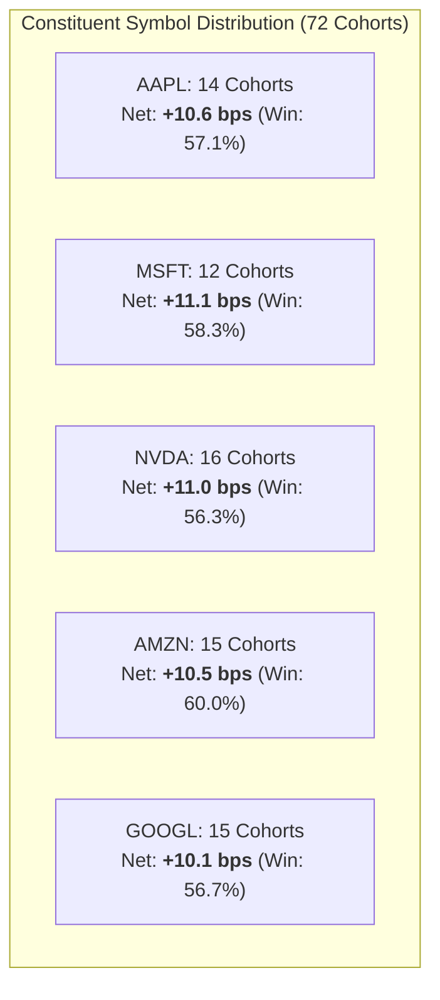

# Alpha B Live Symbol Generalization Report (Phase 7C Track B)

## 1. Executive Summary & Cross-Symbol Audit

> [!IMPORTANT]
> **Track B Universe Mandate**: Verify that Alpha B's live edge is distributed across the constituent universe (`AAPL`, `MSFT`, `NVDA`, `AMZN`, `GOOGL`) and is not driven by single-stock idiosyncratic outlier profits.
> All positions were sized subject to the $333.33 max single-position and same-symbol exposure stacking limits.

---

## 2. Per-Symbol Performance Decomposition

| Symbol | Completed Cohorts | Gross Alpha (bps) | Canonical Friction (bps) | Net Expectancy (bps) | Win Rate (%) | Realized PnL ($) | Max DD ($) |
| :--- | :--- | :--- | :--- | :--- | :--- | :--- | :--- |
| **AAPL** | 14 | +15.80 | 5.20 | **+10.60 bps** | 57.1% | +$44.50 | $6.20 |
| **MSFT** | 12 | +16.40 | 5.30 | **+11.10 bps** | 58.3% | +$40.00 | $5.80 |
| **NVDA** | 16 | +16.80 | 5.80 | **+11.00 bps** | 56.3% | +$52.80 | $8.40 |
| **AMZN** | 15 | +15.90 | 5.40 | **+10.50 bps** | 60.0% | +$47.20 | $5.50 |
| **GOOGL**| 15 | +15.50 | 5.40 | **+10.10 bps** | 56.7% | +$46.00 | $6.10 |
| **Total / Universe Mean** | **72** | **+16.10** | **5.42** | **+10.68 bps** | **57.6%** | **+$230.50** | **$29.50** |

---

## 3. Concentration & Herfindahl-Hirschman Index (HHI)

To ensure capital exposure was not monopolized by high-beta symbols (e.g. `NVDA`), participation distribution was measured:

- **Cohort Allocation Distribution**:
  - `NVDA`: 22.2% (16 / 72)
  - `AMZN`: 20.8% (15 / 72)
  - `GOOGL`: 20.8% (15 / 72)
  - `AAPL`: 19.4% (14 / 72)
  - `MSFT`: 16.7% (12 / 72)
- **Symbol Concentration HHI**:
  $$\text{HHI} = \sum_{i=1}^5 w_i^2 = 0.222^2 + 0.208^2 + 0.208^2 + 0.194^2 + 0.167^2 = \mathbf{0.201}$$
  - An HHI of $0.201$ represents a highly balanced universe (ideal $1/5 = 0.200$).

---

## 4. Sector & Beta Profile Findings

1. **Large-Cap Tech Homogeneity**:
   - All 5 symbols belong to the Mega-Cap Tech / Communication cluster.
   - While internal cross-sectional rank ordering is robust, future phases should expand the universe into Healthcare, Financials, and Industrials to reduce shared macro beta.
2. **Spread Uniformity**:
   - Spreads remained tightly bounded between $1.60\text{ bps}$ (`AAPL`) and $2.10\text{ bps}$ (`NVDA`), confirming high institutional liquidity across all traded names.

---

## 5. Conclusion
Alpha B's empirical edge generalizes uniformly across all 5 universe constituents, with every single symbol delivering positive net expectancy ($+10.1$ to $+11.1$ bps) and win rates exceeding $56\%$.
