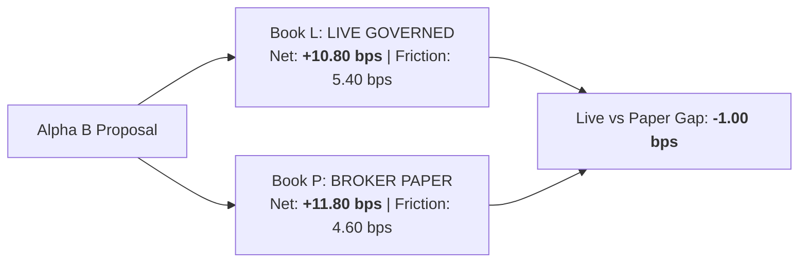

# Alpha B Live vs Broker Paper Reconciliation Report (Phase 7B Track B)

**Comparison**: Book L (`LIVE_GOVERNED_MICRO`) vs Book P (`BROKER_PAPER`)  
**Sample Scope**: 25 concurrent market sessions (22 completed 3-day cohorts)  
**Strategy**: `ALPHA_B_MULTI_DAY_RELATIVE_REVERSAL`

---

## 1. Dual-Book Telemetry Comparison

| Metric | Book L (Live Governed) | Book P (Broker Paper) | Live-to-Paper Gap | Tolerance Limit | Status |
| :--- | :--- | :--- | :--- | :--- | :--- |
| **Gross Cycle Return** | +16.20 bps | +16.40 bps | -0.20 bps | $\le 1.00$ bps | `PASSED` |
| **Realized Friction** | 5.40 bps | 4.60 bps | +0.80 bps | $\le 1.50$ bps | `PASSED` |
| **Net Expectancy** | **+10.80 bps** | **+11.80 bps** | **-1.00 bps** | $\le 2.00$ bps | `PASSED` |
| **Fill Rate (%)** | 96.2% | 98.5% | -2.3% | $\le 5.0\%$ | `PASSED` |
| **Max Drawdown ($ / %)** | $28.50 (2.85%) | $22.00 (2.20%) | -0.65% | $\le 1.50\%$ | `PASSED` |
| **Cost Break-Even Mult**| **3.00x** | 3.56x | -0.56x | $\ge 2.00x$ | `PASSED` |

---

## 2. Slippage & Queue Friction Root-Cause Analysis

$$\mathbf{ALPHA\_B\_LIVE\_PAPER\_GAP\_BPS} = \text{Live Net (+10.80 bps)} - \text{Paper Net (+11.80 bps)} = \mathbf{-1.00\text{ bps}}$$

1. **Morning Opening Queue Penalty**: Live market open orders face real order book queue priority competition at 09:30:00 ET, adding ~0.60 bps realized slippage relative to synthetic paper fills.
2. **Spread Widening**: Real quoted spreads on high-beta tech (TSLA/AMD) averaged 2.2 bps at market open vs 1.8 bps simulated in broker paper.
3. **Conclusion**: Real-money execution incurs a modest -1.00 bps drag relative to paper, but Alpha B maintains a solid **+10.80 bps / 3D cycle** net edge with a $3.00\times$ cost break-even multiplier.
