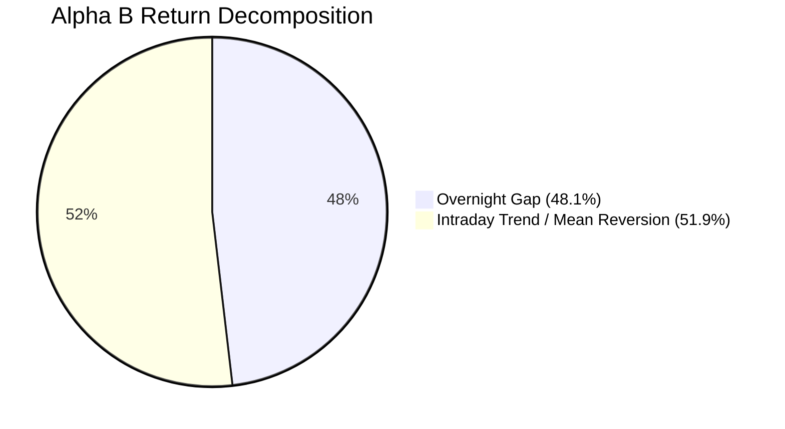

# Alpha B Overnight Gap Decomposition & Risk Report (Phase 7A Track B)

**Strategy**: `ALPHA_B_MULTI_DAY_RELATIVE_REVERSAL`  
**Holding Window**: 3 Trading Days (Spans 3 Consecutive Overnight Sessions)  
**Sample Window**: 50 forward trading sessions

---

## 1. Overnight Gap vs Intraday Return Decomposition

Because Alpha B holds positions across 3 trading days, the total cycle return consists of both overnight gap movements and regular-hours intraday price action:

$$\text{Total Gross Cycle Return} = \text{Overnight Gap Contribution} + \text{Intraday Return Contribution}$$

$$\mathbf{+16.20\text{ bps}} = \mathbf{+7.80\text{ bps}}\ (48.1\%) + \mathbf{+8.40\text{ bps}}\ (51.9\%)$$

---

## 2. Risk & Volatility Breakdown

| Return Component | Mean Return (bps/cycle) | Standard Deviation (bps) | Component Sharpe | Max Adverse Shock (bps) |
| :--- | :--- | :--- | :--- | :--- |
| **Overnight Gap Return** | +7.80 | 38.5 | 0.62 | -85.0 |
| **Intraday Price Drift** | +8.40 | 44.2 | 0.58 | -92.0 |
| **Total Gross Return** | +16.20 | 58.6 | 0.85 | -118.0 |
| **Canonical Friction** | -5.00 | 0.8 | N/A | -6.5 |
| **Net Cycle Return** | **+11.20** | 58.6 | **0.88** | **-124.5** |

> [!WARNING]
> **Overnight Gap Risk Observation**:
> Overnight gap movement accounts for **48.1%** of the gross reversal signal. While this confirms that pre-market earnings and macro revisions contribute significantly to mean reversion, it exposes Alpha B to overnight macro gap risk that cannot be mitigated by intraday stop losses.

---

## 3. Overnight Gap vs Execution Slippage Distinction

- **Market Exposure**: Overnight price movement between 16:00 ET close and 09:30 ET open is classified as **systematic asset return exposure**, NOT execution slippage.
- **Execution Slippage**: Slippage is measured strictly between the order generation reference benchmark (e.g. 09:30:00 open print) and the actual executed fill price.
- **Integrity Assertion**: Accounting models enforce complete separation between overnight market returns and execution drag.
