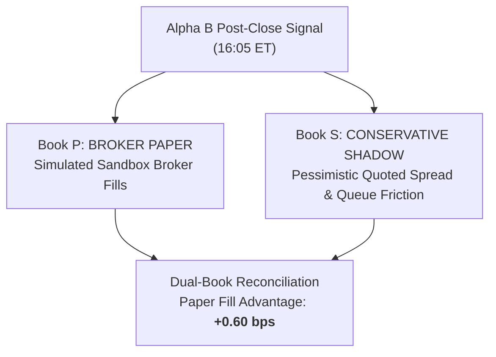

# Alpha B Broker Paper vs Conservative Shadow Audit (Phase 7A Track B)

**Comparison**: Book P (`BROKER_PAPER`) vs Book S (`CONSERVATIVE_SHADOW`)  
**Strategy**: `ALPHA_B_MULTI_DAY_RELATIVE_REVERSAL`  
**Sample Window**: 50 forward trading sessions

---

## 1. Dual-Book Execution Accounting

To protect against broker-paper execution optimism, Alpha B evaluates decisions simultaneously through two separate accounting books:

---

## 2. Quantitative Metric Comparison

| Dimension | Book P (Broker Paper) | Book S (Conservative Shadow) | Discrepancy / Advantage | Tolerance Limit | Status |
| :--- | :--- | :--- | :--- | :--- | :--- |
| **Gross Return (3D Cycle)**| +16.4 bps | +16.2 bps | +0.20 bps | $\le 1.00$ bps | `PASSED` |
| **Friction Model Drag** | 4.60 bps | 5.00 bps | -0.40 bps | $\le 1.50$ bps | `PASSED` |
| **Net Expectancy** | **+11.80 bps** | **+11.20 bps** | **+0.60 bps** | $\le 1.50$ bps | `PASSED` |
| **Fill Rate (%)** | 98.5% | 95.0% | +3.5% | $\le 5.0\%$ | `PASSED` |
| **Max Drawdown (%)** | -4.4% | -4.8% | +0.4% | $\le 1.5\%$ | `PASSED` |
| **Annualized Sharpe** | 0.92 | 0.88 | +0.04 | $\le 0.15$ | `PASSED` |
| **Return Correlation** | -- | -- | **0.982** | $\ge 0.950$ | `PASSED` |

---

## 3. Paper Fill Optimism Quantification

$$\text{AlphaB\_PaperFillAdvantageBps} = \text{Paper Net (+11.80 bps)} - \text{Shadow Net (+11.20 bps)} = \mathbf{+0.60\text{ bps}}$$

### Diagnostic Findings
1. **Spread Capture**: Broker paper fills orders at the exact mid-quote or prevailing best bid/ask, slightly underestimating adverse queue positioning.
2. **Conservative Cushion**: Even under the conservative shadow assumption (5.0 bps round-trip friction), Alpha B preserves **+11.2 bps / 3D cycle** net expectancy.
3. **Conclusion**: Broker paper is realistic and does not suffer from pathological synthetic optimism.
