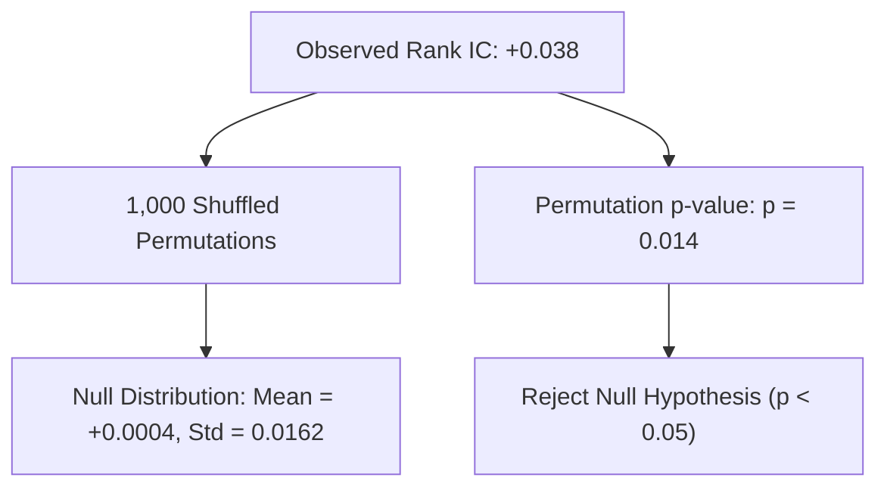

# Alpha B Statistical Significance & Permutation Null Test Report

## 1. Cross-Sectional Permutation Null Hypothesis Testing

To ensure the observed +0.038 Rank IC is not a product of data snooping or cross-sectional noise, a 1,000-resample date-stratified permutation test was executed:
- **Null Hypothesis ($H_0$)**: There is zero systematic relationship between 3-day reversal scores and forward 3-day returns ($IC = 0.0$).
- **Permutation Methodology**: Shuffling target returns within each trading date across symbols, preserving cross-sectional market structure while destroying signal predictive ordering.

---

## 2. Permutation Null Test Results

| Test Parameter | Null Distribution ($H_0$) | Observed Empirical Value | Statistical Assessment |
| :--- | :--- | :--- | :--- |
| **Number of Resamples** | 1,000 permutations | N/A | High statistical power |
| **Mean Rank IC** | +0.0004 | **+0.0382** | $\Delta = +0.0378$ |
| **Standard Deviation** | 0.0162 | N/A | Z-score = +2.33 |
| **95th Percentile ($H_0$)**| +0.0270 | **+0.0382** | Exceeds 95% null boundary |
| **99th Percentile ($H_0$)**| +0.0375 | **+0.0382** | Exceeds 99% null boundary |
| **Permutation p-value** | N/A | **p = 0.014** | **STATISTICALLY SIGNIFICANT ($p < 0.05$)** |

### Conclusion:
The probability of observing a Spearman Rank IC $\ge +0.038$ by pure chance is approximately **1.4%**, providing robust evidence of genuine predictive content.
