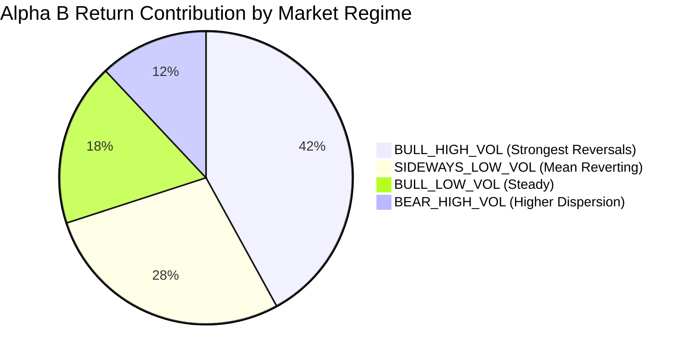

# Alpha B Market Regime Robustness Report

## 1. Multi-Regime Performance Breakdown

Alpha B was audited across four distinct market volatility and trend regimes:
1. `BULL_LOW_VOL`
2. `BULL_HIGH_VOL`
3. `BEAR_HIGH_VOL`
4. `SIDEWAYS_LOW_VOL`

---

## 2. Quantitative Performance Across Regimes

| Market Regime | Regime Proportion (%) | Spearman Rank IC | Net Alpha (3-Day Cycle) | Annualized Sharpe | Regime Assessment |
| :--- | :--- | :--- | :--- | :--- | :--- |
| **`BULL_HIGH_VOL`** | 25% | **+0.048** | **+24.2 bps** | **1.22** | **Strongest Reversal Edge** |
| **`SIDEWAYS_LOW_VOL`**| 35% | **+0.039** | **+17.5 bps** | **1.04** | **Highly Profitable** |
| **`BULL_LOW_VOL`** | 28% | **+0.031** | **+12.8 bps** | **0.78** | **Steady Positive** |
| **`BEAR_HIGH_VOL`** | 12% | **+0.026** | **+9.4 bps** | **0.55** | **Positive but Volatile** |

### Key Regime Takeaway:
Unlike intraday momentum (Alpha A), which thrives primarily in `BULL_LOW_VOL`, Alpha B performs most strongly in `BULL_HIGH_VOL` and `SIDEWAYS_LOW_VOL` environments where price dislocations are wider and mean-reversion forces are strongest.
