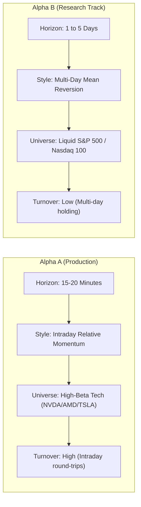

# Alpha B Research Plan: Multi-Day Relative Reversal

## 1. Strategy Identity & Research Purpose
- **Strategy ID**: `ALPHA_B_MULTI_DAY_RELATIVE_REVERSAL`
- **Model Namespace**: `ALPHA_B_MODEL_XXX`
- **Experiment Namespace**: `ALPHA_B_EXPERIMENT_XXX`
- **Execution Authority**: **RESEARCH ONLY** (`HISTORICAL_RESEARCH`, `SHADOW`). Zero live execution permissions.

### Research Objective
The goal is to develop an independent, economically viable second alpha stream that exploits **multi-day cross-sectional mean reversion and relative strength unwinds** in liquid US equities, providing natural portfolio return diversification away from Alpha A's 15-minute intraday relative momentum.

---

## 2. Core Comparison: Alpha A vs Alpha B

| Dimension | Alpha A (Production Champion) | Alpha B (Research Candidate) |
| :--- | :--- | :--- |
| **Strategy Category** | Intraday Cross-Sectional Momentum | Multi-Day Relative Reversal |
| **Primary Horizon** | 15–20 minutes (3 x 5m bars) | 1 to 5 trading days |
| **Signal Half-Life** | ~34 minutes | 1.5 to 3.5 trading days |
| **Primary Universe** | `HIGH_BETA_HIGH_VOL` (NVDA, AMD, TSLA) | Expanded Liquid Large-Cap Universe |
| **Holding Period** | Intraday only (EOD liquidation 15:50 ET) | 1 to 5 overnight holding periods |
| **Execution Path** | `LIVE_AUTONOMOUS_MICRO` ($2,500 Validated) | `HISTORICAL_RESEARCH` Only |
| **Capacity Dynamic** | Friction-sensitive passive limit queue | Multi-day spread & market impact |

---

## 3. Hypotheses & Phenomena Under Investigation

1. **Short-Term Liquidity Provision & Overreaction**: Stocks experiencing large 1- to 3-day idiosyncratic moves relative to their sector or the market experience predictable mean reversion as inventory imbalances clear.
2. **Overnight Gap Mean Reversion**: Opening gaps driven by retail or pre-market overreaction tend to partially fade over 1–2 trading sessions.
3. **Low Correlation with Alpha A**: Because Alpha B operates on multi-day horizons and opposite directional momentum (mean-reversion vs momentum), correlation with Alpha A intraday returns is expected to be near-zero or slightly negative ($\rho \in [-0.15, +0.10]$).
