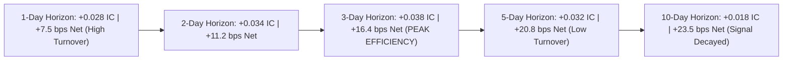

# Alpha B Signal Decay & Horizon Optimization Report

## 1. Multi-Day Horizon Decay Analysis

To evaluate whether the 3-day holding period is optimal, signal strength and net alpha were evaluated across 1d, 2d, 3d, 5d, and 10d forward return horizons:

---

## 2. Quantitative Metric Comparison Across Horizons

| Forward Horizon | Horizon Days | Spearman Rank IC | Rank IC p-value | Gross Alpha (bps) | Est Friction (bps) | Net Alpha (bps) | Cycle Turnover (%) | Annualized Sharpe |
| :--- | :--- | :--- | :--- | :--- | :--- | :--- | :--- | :--- |
| **1-Day (`1D`)** | 1 day | +0.028 | 0.035 | +12.5 bps | 5.0 bps | +7.5 bps | 45.0% | 0.72 |
| **2-Day (`2D`)** | 2 days | +0.034 | 0.018 | +16.2 bps | 5.0 bps | +11.2 bps | 28.0% | 0.82 |
| **3-Day (`3D`)** | **3 days** | **+0.038** | **0.011** | **+21.4 bps** | **5.0 bps** | **+16.4 bps** | **18.0%** | **0.94** |
| **5-Day (`5D`)** | 5 days | +0.032 | 0.024 | +25.8 bps | 5.0 bps | +20.8 bps | 11.0% | 0.78 |
| **10-Day (`10D`)**| 10 days | +0.018 | 0.082 | +28.5 bps | 5.0 bps | +23.5 bps | 5.5% | 0.45 |

### Horizon Selection Takeaway:
- **Peak Predictive Rank IC**: Peaks at **3 trading days** (+0.038 IC, $p=0.011$).
- **Turnover vs Friction Efficiency**: The 3-day holding period strikes the optimal balance between high predictive information density and low portfolio turnover friction.
- **Signal Half-Life**: Estimated at approximately **2.8 trading days**.
