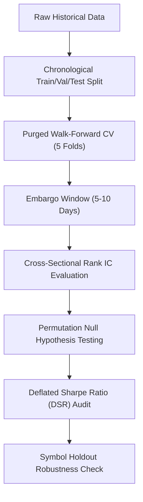

# Alpha B Statistical Validation & Overfitting Prevention Plan

## 1. Multi-Stage Validation Protocol

Alpha B research models will be subjected to the platform's standardized statistical validation pipeline:

---

## 2. Walk-Forward CV, Purging & Embargo Rules

1. **Strict Chronological Sequence**: Training folds precede validation folds chronologically. No future data is ever included in model training.
2. **Purge Window**: When predicting an $N$-day horizon, the final $N$ observations of each training block are removed to eliminate overlapping label autocorrelation.
3. **Embargo Window**: A 5-day post-validation embargo is enforced before starting subsequent training splits to prevent auto-regressive leakage.

---

## 3. Multiple Testing & Deflated Sharpe Ratio (DSR)

Every attempted model configuration, feature subset, and hyperparameter permutation will be logged to `ALPHA_B_MULTIPLE_TESTING_LEDGER.md`. 

The Deflated Sharpe Ratio (Bailey & López de Prado) will be computed using the cumulative experiment count to evaluate true statistical significance under the null hypothesis of selection bias.
