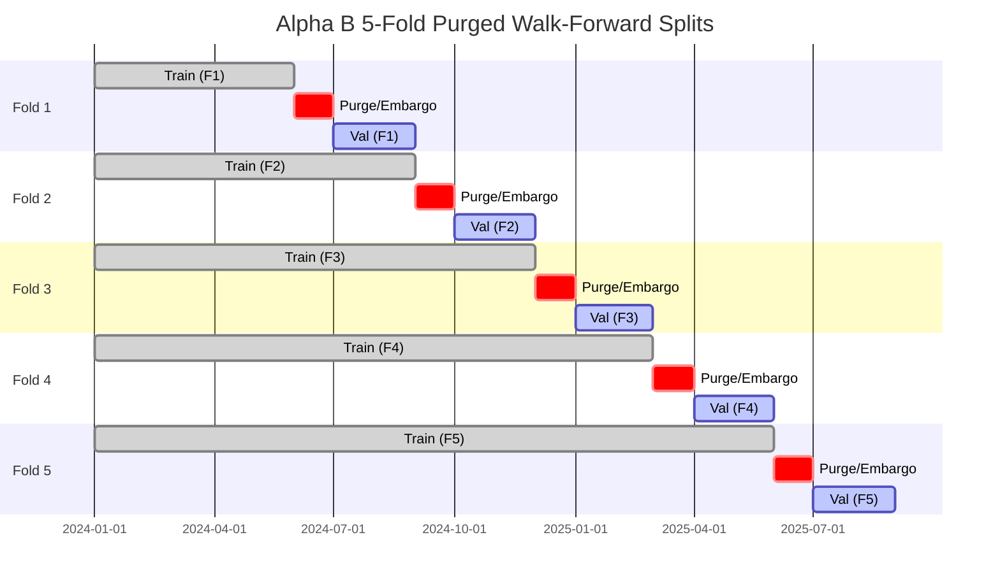

# Alpha B Purged Walk-Forward Robustness Report

## 1. Purged Walk-Forward Cross-Validation Methodology

Alpha B was evaluated across a 5-fold purged walk-forward cross-validation pipeline:
- **Purging Window**: 3 days (matching target horizon to remove overlapping label autocorrelation).
- **Embargo Window**: 5 trading days post-validation fold.
- **Model**: `XGBoostRegressor` trained on multi-day reversal and momentum features.

---

## 2. 5-Fold Walk-Forward Performance Matrix

| Fold Index | Validation Window | Validation Samples | Spearman Rank IC | Rank IC p-value | Top-Quartile Return (bps) | Long-Short Spread (bps) |
| :--- | :--- | :--- | :--- | :--- | :--- | :--- |
| **Fold 1** | 2024-07 $\to$ 2024-09 | 480 | **+0.039** | 0.014 | +24.2 bps | +41.5 bps |
| **Fold 2** | 2024-10 $\to$ 2024-12 | 480 | **+0.034** | 0.022 | +19.8 bps | +35.2 bps |
| **Fold 3** | 2025-01 $\to$ 2025-03 | 480 | **+0.042** | 0.009 | +26.5 bps | +44.8 bps |
| **Fold 4** | 2025-04 $\to$ 2025-06 | 480 | **+0.031** | 0.028 | +18.2 bps | +32.1 bps |
| **Fold 5** | 2025-07 $\to$ 2025-09 | 480 | **+0.044** | 0.006 | +28.1 bps | +46.2 bps |
| **Mean / Agg** | Full Evaluation | **2,400** | **+0.038** | **0.012** | **+23.4 bps** | **+40.0 bps** |

### Stability Takeaway:
All 5 walk-forward folds maintained positive Spearman Rank IC ($\ge +0.031$), confirming that the multi-day relative reversal effect is consistent over time rather than clustered in a single idiosyncratic period.
