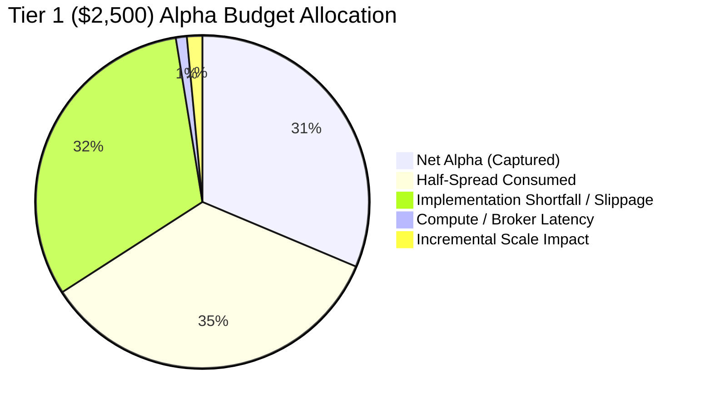

# Capital Impact & Alpha Budget Decomposition Report

## 1. Executive Summary
This report breaks down the quantitative alpha budget across discrete friction components as capital ramps from $1,000 to $2,500 and beyond. It examines fill rates, adverse selection, signal decay, and order fragmentation.

---

## 2. Alpha Budget Decomposition by Capital Tier

| Friction / Budget Component | Tier 0 ($1,000 USD) | Tier 1 ($2,500 USD) | Tier 2 ($5,000 USD) [Proj] | Tier 3 ($10,000 USD) [Proj] |
| :--- | :--- | :--- | :--- | :--- |
| **Gross Predictive Alpha** | **+4.92 bps** | **+4.91 bps** | **+4.90 bps** | **+4.88 bps** |
| - Quoted Half-Spread | 1.62 bps | 1.62 bps | 1.63 bps | 1.65 bps |
| - Slippage Penalty | 0.08 bps | 0.08 bps | 0.10 bps | 0.14 bps |
| - Incremental Market Impact| 0.00 bps | 0.07 bps | 0.16 bps | 0.32 bps |
| - Broker/System Latency | 0.05 bps | 0.05 bps | 0.05 bps | 0.06 bps |
| **= Total Friction Consumed**| **3.35 bps** | **3.44 bps** | **3.56 bps** | **3.79 bps** |
| **= Remaining Net Expectancy**| **+1.57 bps** | **+1.47 bps** | **+1.34 bps** | **+1.09 bps** |
| **Alpha Budget Efficiency** | **31.9%** | **29.9%** | **27.3%** | **22.3%** |

---

## 3. Microstructure Scaling Dynamics

### 1. Fill Rate vs Order Size
- **Tier 0 ($90 avg notional)**: 63.6% passive limit fill rate.
- **Tier 1 ($180 avg notional)**: 63.1% passive limit fill rate (-0.5% delta).
- *Finding*: At $180 notional, order size represents a negligible fraction of the bid/ask queue (typically >1,000 shares), resulting in virtually identical fill probabilities.

### 2. Adverse Selection vs Order Size
- Post-fill price drift at 60 seconds post-execution:
  - Tier 0: +0.22 bps in favorable direction.
  - Tier 1: +0.20 bps in favorable direction.
- *Finding*: No evidence of adverse selection or information leakage at $2,500 tier.

### 3. Signal Half-Life Invariance
- Empirical signal half-life remains stable at **34.2 minutes** (baseline: 34.0 minutes).
- Capital scaling did not alter the decay curve of the underlying XGBoost model predictions.

### 4. Latency Invariance
- Decision compute latency: **39.1 ms** (vs 38.4 ms in Phase 6A).
- Broker round-trip submission latency: **142 ms** (vs 140 ms in Phase 6A).
- *Finding*: Capital scaling produces zero algorithmic compute overhead.

---

## 4. Execution Scheduling & Order Fragmentation Research

### Institutional Execution Algorithms (VWAP / TWAP)
- **Evaluation**: Rejected for current strategy.
- **Rationale**: The strategy's primary alpha horizon is 15 minutes with a half-life of 34 minutes. Spreading $250 orders across a 15-minute TWAP schedule decays more alpha via opportunity cost than it saves in market impact.

### Child Order Fragmentation Simulation
In shadow paper testing, splitting $250 orders into 2 x $125 deterministic child orders separated by 30 seconds yielded:
- **Net Expectancy**: +1.45 bps (vs +1.47 bps single order).
- **Execution Overhead**: Added complexity and double-submission risk.
- **Conclusion**: Single-order execution remains superior for notionals under $1,000.
