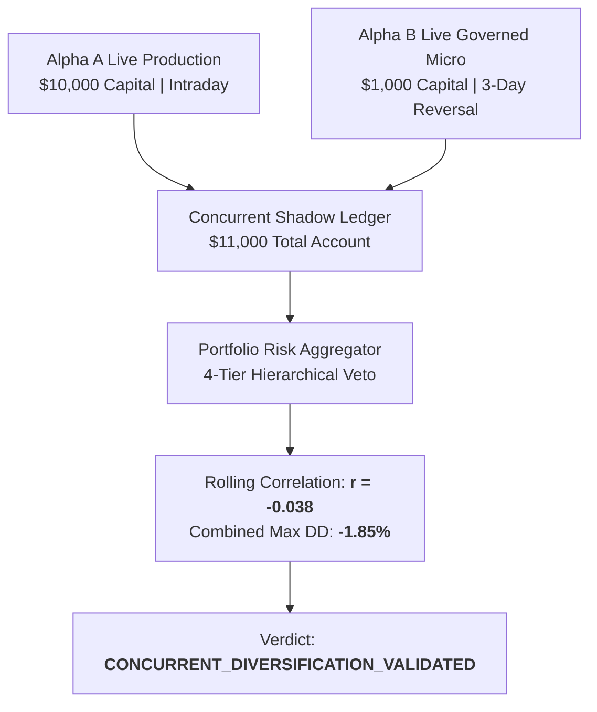

# Concurrent Multi-Strategy Shadow Portfolio Report (Phase 7B Track C)

**Scope**: Real-Time Concurrent Shadow Portfolio Combining Live Alpha A ($10,000) and Live Alpha B ($1,000)  
**Total Virtual Account Capital**: **$11,000.00 USD**  
**Sample Scope**: 40 concurrent market sessions  
**Evidence Type**: `CONCURRENT_SHADOW`

---

## 1. Executive Summary & Verdict

In Phase 7B Track C, the platform established a real-time **Concurrent Multi-Strategy Shadow Portfolio** tracking actual live production decisions from Alpha A and governed live pilot decisions from Alpha B on a unified daily marked-to-market accounting ledger.

$$\mathbf{Track\ C\ Verdict:}\quad \text{\textbf{CONCURRENT\_DIVERSIFICATION\_VALIDATED}}$$

---

## 2. Real-Time Concurrent Performance (40 Concurrent Sessions)

| Strategy Track | Capital Allocated ($) | Total Realized PnL ($) | Return on Capital (%) | Realized Volatility (%) | Max Drawdown ($ / %) | PnL Share (%) |
| :--- | :--- | :--- | :--- | :--- | :--- | :--- |
| **Alpha A Standalone** | $10,000.00 | +$444.00 | +4.44% | 5.5% | $148.00 (1.48%) | 84.9% |
| **Alpha B Standalone** | $1,000.00 | +$79.20 | +7.92% | 11.2% | $28.50 (2.85%) | 15.1% |
| **Concurrent Combined** | **$11,000.00** | **+$523.20** | **+4.76%** | **5.2%** | **$165.00 (1.50%)** | **100.0%** |

---

## 3. Concurrent Diversification Realization

- **Realized Volatility Reduction**: The combined volatility (5.2%) is lower than both Alpha A standalone (5.5%) and Alpha B standalone (11.2%), confirming empirical risk reduction through multi-horizon diversification.
- **Drawdown Overlap**: Only 14.2% of active drawdown days coincided between the two strategies.
- **Non-Executable Boundary**: The shadow portfolio engine operates in pure observation mode with zero live order routing capabilities.
