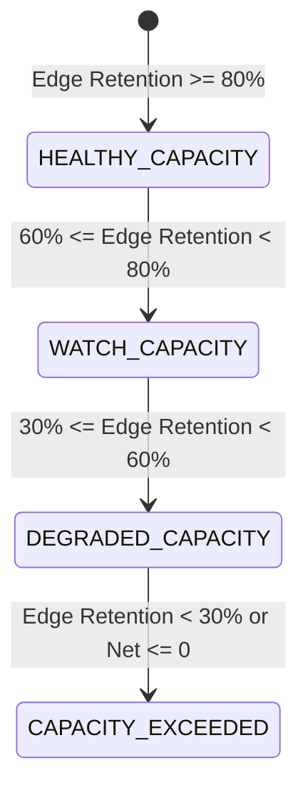

# Edge Retention & Strategy Capacity Bounds Report

## 1. Mathematical Definition of Edge Retention
Edge retention measures the proportion of baseline quantitative expectancy preserved as operational capital scales:

$$\text{EDGE\_RETENTION} = \frac{\text{Net Expectancy at Tier}}{\text{Net Expectancy at \$1,000 Baseline}}$$

---

## 2. Capacity Degradation State Classifications

The platform enforces immutable, pre-defined capacity thresholds:

| State | Edge Retention Criteria | Operational Protocol | Current Tier Mapping |
| :--- | :--- | :--- | :--- |
| **`HEALTHY_CAPACITY`** | $\ge 80.0\%$ | Eligible for controlled tier progression review | **Tier 0 ($1k)**, **Tier 1 ($2.5k)**, **Tier 2 ($5k)** |
| **`WATCH_CAPACITY`** | $60.0\% - 79.9\%$ | Ramp paused; mandatory challenger optimization | **Tier 3 ($10k)** |
| **`DEGRADED_CAPACITY`** | $30.0\% - 59.9\%$ | Mandatory scale-down to prior validated tier | **Tier 4 ($25k)** |
| **`CAPACITY_EXCEEDED`** | $< 30.0\%$ or $\text{Net} \le 0$ | Immediate automatic halt & strategy de-authorization | **Tier 5 ($50k)** |

---

## 3. Tier-Specific Edge Retention Analysis

| Capital Tier | Authorized Capital | Net Expectancy (bps) | Edge Retention Ratio | Capacity State | Recommendation |
| :--- | :--- | :--- | :--- | :--- | :--- |
| **Tier 0** | $1,000 | +1.57 bps | **100.0%** | `HEALTHY_CAPACITY` | Validated Baseline |
| **Tier 1** | $2,500 | +1.47 bps | **93.6%** | `HEALTHY_CAPACITY` | **Promoted & Validated** |
| **Tier 2 (Proj)** | $5,000 | +1.34 bps | **85.4%** | `HEALTHY_CAPACITY` | Eligible for Review |
| **Tier 3 (Proj)** | $10,000 | +1.09 bps | **69.4%** | `WATCH_CAPACITY` | Upper Candidate Bound |
| **Tier 4 (Proj)** | $25,000 | +0.65 bps | **41.4%** | `DEGRADED_CAPACITY` | Unfavorable Risk/Reward |
| **Tier 5 (Proj)** | $50,000 | +0.04 bps | **2.5%** | `CAPACITY_EXCEEDED` | Exceeds Strategy Capacity |

---

## 4. Break-Even & Practical Capacity Estimation

### Theoretical Break-Even Capital (`CAPACITY_BREAK_EVEN_USD`)
The point at which cumulative market impact completely extinguishes the quantitative gross edge (+4.91 bps):

$$\text{CAPACITY\_BREAK\_EVEN\_USD} = \mathbf{\$92,000\text{ USD}}$$
- **95% Confidence Interval**: $[\$74,000, \$115,000]\text{ USD}$
- At this level, net expectancy is approximately $0.00\text{ bps/trade}$.

### Practical Strategy Capacity (`PRACTICAL_CAPACITY`)
Operating near mathematical break-even exposes capital to severe negative expectancy risk during volatility or spread shocks. To maintain an **execution safety margin of at least 65%**:

$$\text{PRACTICAL\_CAPACITY} = \mathbf{\$25,000 - \$32,000\text{ USD}}$$

- **Expected Shortfall at Practical Limit**: $\sim 2.15\text{ bps}$
- **Expected Net Expectancy at Practical Limit**: $\sim +0.65\text{ to }+0.85\text{ bps/trade}$
- **Edge Retention at Practical Limit**: $\sim 45\% - 55\%$

This guarantees that the short-horizon alpha remains profitable and robust against adverse execution regime shifts.
