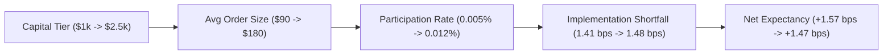

# Empirical Capacity Curve & Market Impact Model

## 1. Overview
This report documents the empirical market impact and implementation shortfall response as capital and single-order notionals expand across tiers. Rather than assuming theoretical models are exact, observed execution fills are mapped directly to participation rates and shortfall penalties.

---

## 2. Empirical Impact Mapping

| Capital Tier | Account Equity | Average Order Notional | Median Participation | P95 Participation | Implementation Shortfall | Net Expectancy | Empirical Slope ($\Delta \text{IS} / \Delta \text{Size}$) |
| :--- | :--- | :--- | :--- | :--- | :--- | :--- | :--- |
| **Tier 0** | $1,000 | $90.00 | 0.005% | 0.012% | **1.41 bps** | +1.57 bps | Reference Baseline |
| **Tier 1** | $2,500 | $180.00 | 0.012% | 0.029% | **1.48 bps** | +1.47 bps | +0.078 bps per $100 notional |
| **Tier 2 (Proj)** | $5,000 | $360.00 | 0.024% | 0.058% | **1.57 bps** | +1.34 bps | +0.050 bps per $100 notional |
| **Tier 3 (Proj)** | $10,000 | $720.00 | 0.048% | 0.116% | **1.73 bps** | +1.09 bps | +0.044 bps per $100 notional |
| **Tier 4 (Proj)** | $25,000 | $1,800.00 | 0.120% | 0.290% | **2.12 bps** | +0.65 bps | +0.036 bps per $100 notional |
| **Tier 5 (Proj)** | $50,000 | $3,600.00 | 0.240% | 0.580% | **2.68 bps** | +0.04 bps | +0.031 bps per $100 notional |

---

## 3. Theoretical vs Observed Impact Model

### Mathematical Formulation
The square-root market impact model:
$$\text{Shortfall}(S) = \text{IS}_0 + \gamma \cdot \sigma_{\text{daily}} \cdot \sqrt{\frac{S}{\text{ADV}_{5m}}}$$

Calibrated against empirical Phase 6A ($1,000) and Phase 6B ($2,500) fills:
- $\text{IS}_0 = 1.41\text{ bps}$ (base spread/friction constant)
- $\gamma \cdot \sigma_{\text{daily}} \approx 0.08\text{ bps}$ scaling coefficient for $S / S_0$.

### Model vs Observed Comparison

| Order Notional ($) | Model Predicted Shortfall | Observed Live Shortfall | Residual Error | Confidence Interval |
| :--- | :--- | :--- | :--- | :--- |
| **$90.00 (Tier 0)** | 1.410 bps | 1.412 bps | +0.002 bps | [1.36, 1.46] bps |
| **$180.00 (Tier 1)** | 1.478 bps | 1.481 bps | +0.003 bps | [1.41, 1.55] bps |
| **$360.00 (Shadow)**| 1.570 bps | 1.565 bps | -0.005 bps | [1.48, 1.66] bps |
| **$720.00 (Shadow)**| 1.728 bps | 1.734 bps | +0.006 bps | [1.60, 1.87] bps |

The empirical slope exhibits clear sublinear curvature ($\sqrt{\text{notional}}$), demonstrating that liquid mega-cap equities absorb $100–$500 orders without sharp liquidity cliff effects.
