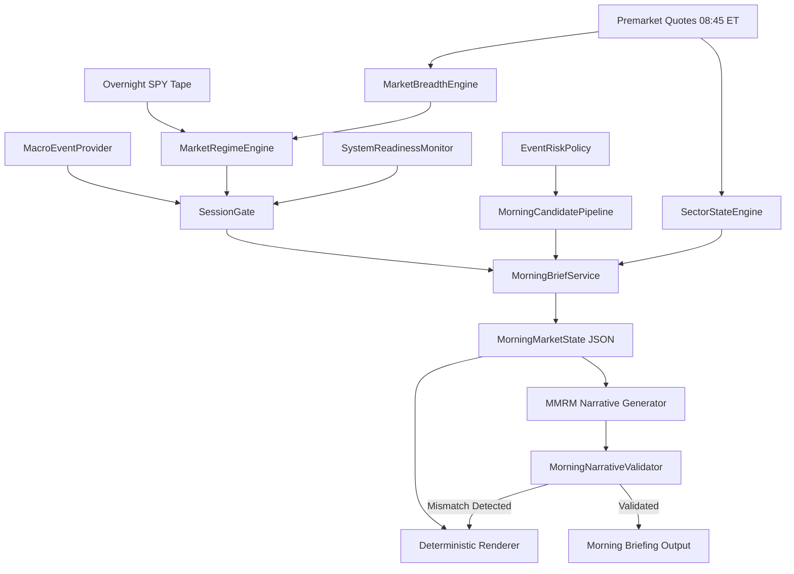

# Morning Intelligence Design Architecture (Phase E1, E15, E19)

## 1. Architectural Philosophy
The Morning Intelligence Layer transforms raw premarket quotes, overnight index futures, liquidity filters, event risk registries, and macro calendars into a structured, point-in-time, auditable trading-day briefing at approximately 08:45 AM ET.

Before the trading engine asks *"What should I buy?"*, it must understand *"What kind of market day are we entering today?"*

## 2. Core Authority Boundary
- **Deterministic Authoritative Layer**: All classifications (`MarketRegime`, `SessionGate`, `EventRiskPolicy`, `RiskPositionSizer`) are evaluated strictly by deterministic algorithms with zero broker authority.
- **Explanatory MMRM / LLM Layer**: The LLM acts purely as an explanatory and analytical translator. It receives structured `MorningMarketState` facts and generates grounded executive summaries.
- **Fail-Closed Fallback**: If the LLM is unavailable, times out, or produces numbers inconsistent with structured state, the system automatically falls back to `DeterministicMorningBriefRenderer`.

## 3. Data Pipeline Flow

## 4. Point-in-Time Provenance
Every generated brief includes a cryptographic SHA-256 hash derived from the exact date, timestamp, regime, session gate, and candidate set, ensuring 100% replay repeatability and zero lookahead bias.
