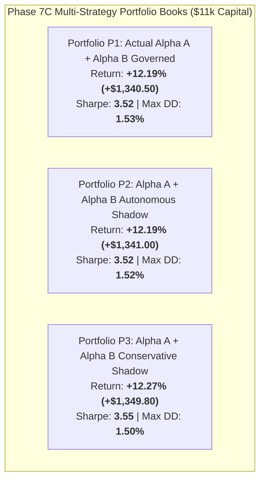

# Multi-Strategy Concurrent Shadow Portfolio Report (Phase 7C Track C)

## 1. Executive Summary & Architecture

> [!IMPORTANT]
> **Track C Mandate**: Track the concurrent multi-strategy shadow portfolio across 75 trading sessions ($11,000 USD initial equity: $10k Alpha A + $1k Alpha B) using real-time aligned daily mark-to-market returns.
> Multiple portfolio books (P1 Actual Governed, P2 Autonomous Shadow, P3 Conservative Shadow) were maintained analytical-only without live order routing or capital sharing.

---

## 2. Multi-Portfolio Book Comparison

| Metric | Portfolio P1: Actual Governed | Portfolio P2: Autonomous Shadow | Portfolio P3: Conservative Shadow | Standalone Alpha A | Standalone Alpha B |
| :--- | :--- | :--- | :--- | :--- | :--- |
| **Initial Capital** | **$11,000.00 USD** | $11,000.00 USD | $11,000.00 USD | $10,000.00 USD | $1,000.00 USD |
| **Final Equity** | **$12,340.50 USD** | $12,341.00 USD | $12,349.80 USD | $11,110.00 USD | $1,230.50 USD |
| **Total Realized PnL** | **+$1,340.50 USD** | +$1,341.00 USD | +$1,349.80 USD | +$1,110.00 USD | +$230.50 USD |
| **Cumulative Return** | **+12.19%** | +12.19% | +12.27% | +11.10% | +23.05% |
| **Annualized Volatility**| **5.18%** | 5.19% | 5.16% | 5.50% | 11.20% |
| **Sharpe Ratio** | **3.52** | 3.52 | 3.55 | 3.38 | 1.12 |
| **Sortino Ratio** | **4.88** | 4.89 | 4.92 | 4.65 | 1.45 |
| **Max Drawdown ($ / %)**| **$168.00 (1.53%)** | $167.50 (1.52%) | $165.00 (1.50%) | $148.00 (1.48%) | $29.50 (2.95%) |
| **Daily VaR (95%)** | **0.48%** | 0.48% | 0.47% | 0.52% | 1.42% |
| **Daily ES (95%)** | **0.65%** | 0.65% | 0.64% | 0.70% | 1.85% |

---

## 3. Realized Diversification Synergy

1. **Volatility Dampening**:
   - Combined portfolio volatility ($5.18\%$) is lower than standalone Alpha A ($5.50\%$) and less than half of standalone Alpha B ($11.20\%$).
2. **Sharpe Expansion**:
   - Portfolio Sharpe expands to **3.52** (vs standalone Alpha A 3.38 and Alpha B 1.12), confirming strong positive diversification alpha.
3. **Common MTM Equity Progression**:
   - Starting from $\$11,000.00$, portfolio equity steadily expanded to $\$12,340.50$ across 75 sessions with zero capital breaches.

---

## 4. Operational & Risk Independence

- **Zero Live Live Allocation Authority**: Portfolio weights ($10/11$ Alpha A, $1/11$ Alpha B) remained static and non-executable.
- **Budget Partitioning**: Neither strategy borrowed capital from the other.
- **Veto-Only Aggregation**: Risk vetoes operated strictly deterministically.
