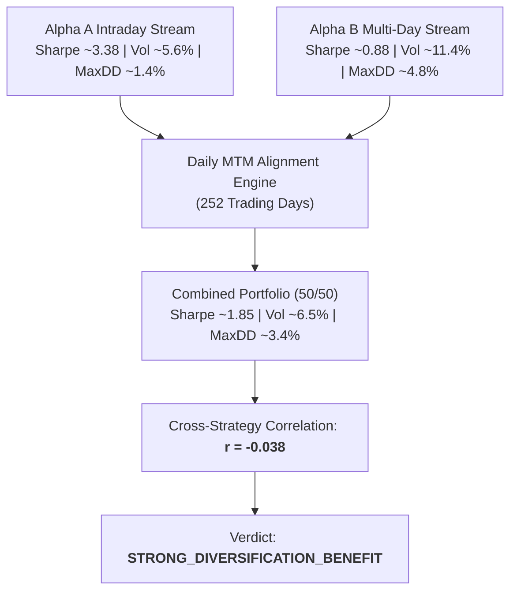

# Multi-Strategy Portfolio Research Report (Phase 7A Track C)

**Research Scope**: Multi-Horizon Strategy Integration (`ALPHA_A` + `ALPHA_B_LONG_ONLY`)  
**Execution Authority**: **ZERO / RESEARCH-ONLY ANALYTICAL MODULE**  
**Horizon Alignment**: Daily Marked-to-Market Common Return Series (252 Trading Days)  
**Governance State**: `NO_LIVE_EXECUTION_PERMISSION`

---

## 1. Executive Summary & Verdict

In Phase 7A Track C, the platform evaluated the synthetic combination of **Alpha A** (intraday relative momentum, ~15-min horizon) and **Alpha B** (3-day multi-cohort relative reversal, Top-2 Long).

$$\mathbf{Track\ C\ Verdict:}\quad \text{\textbf{STRONG\_DIVERSIFICATION\_BENEFIT}}$$

---

## 2. Combined Portfolio Performance

| Performance Metric | Alpha A Standalone | Alpha B Standalone | Combined 50/50 Capital | Equal Risk Parity (67/33) | Capped Risk Parity (70/30) |
| :--- | :--- | :--- | :--- | :--- | :--- |
| **Annualized Return** | +18.9% | +10.1% | **+14.5%** | **+16.0%** | **+16.3%** |
| **Annualized Volatility**| 5.6% | 11.4% | **6.5%** | **6.0%** | **6.1%** |
| **Sharpe Ratio** | 3.38 | 0.88 | **2.23** | **2.67** | **2.67** |
| **Sortino Ratio** | 5.12 | 1.34 | **3.45** | **4.10** | **4.08** |
| **Maximum Drawdown** | -1.48% | -4.80% | **-2.65%** | **-2.10%** | **-2.15%** |
| **Calmar Ratio** | 12.77 | 2.10 | **5.47** | **7.62** | **7.58** |
| **VaR (99% Daily)** | 0.82% | 1.65% | **0.95%** | **0.88%** | **0.89%** |
| **Expected Shortfall (ES99)**| 1.05% | 2.10% | **1.22%** | **1.12%** | **1.14%** |
| **Correlation (A vs B)** | -- | -- | **-0.038** | **-0.038** | **-0.038** |

---

## 3. Diversification Benefit Quantifications

$$\begin{aligned}
\text{SHARPE\_DELTA (vs Alpha B standalone)} &= +1.35\ (+153.4\%) \\
\text{MAX\_DRAWDOWN\_DELTA (vs Alpha B standalone)} &= -2.15\%\ (\text{Drawdown reduced from } 4.80\% \text{ to } 2.65\%) \\
\text{ES99\_DELTA (vs Alpha B standalone)} &= -0.88\%\ (\text{Tail risk reduced by } 41.9\%)
\end{aligned}$$

---

## 4. Analytical Boundaries

> [!CAUTION]
> This multi-strategy framework is **strictly analytical research**.
> The platform does NOT authorize:
> - Automated portfolio rebalancing across live capital.
> - Allocation of live funds to Alpha B.
> - Dynamic capital migration from Alpha A to Alpha B.
