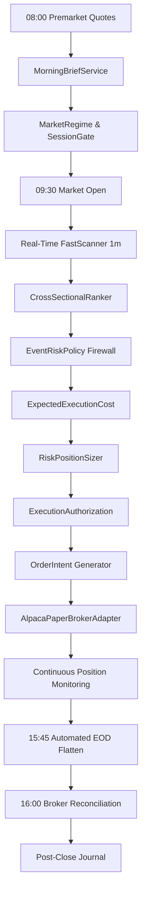

# Paper Trading Runtime Architecture (Phase F1)

## 1. System Overview
The Moneymaker Paper Trading Runtime connects all quantitative research and risk management layers into an autonomous forward execution machine operating strictly in `ExecutionEnvironment.PAPER`.

## 2. Complete End-to-End Operating Cycle

## 3. Core Safety Invariants
1. **Absolute Real-Money Firewall**: Any execution mode other than `PAPER` or `SIMULATION` raises `RealMoneyAuthorizationError`.
2. **Strategy Capital Ledger**: Position sizes and exposure ceilings derive strictly from authorized proving capital ($1,000.00).
3. **Idempotent Order Intents**: Unique cryptographic `order_intent_id` prevents duplicate submissions.
4. **Automated EOD Flattening**: Flattening window (15:45-15:55 ET) ensures zero overnight equity risk.
