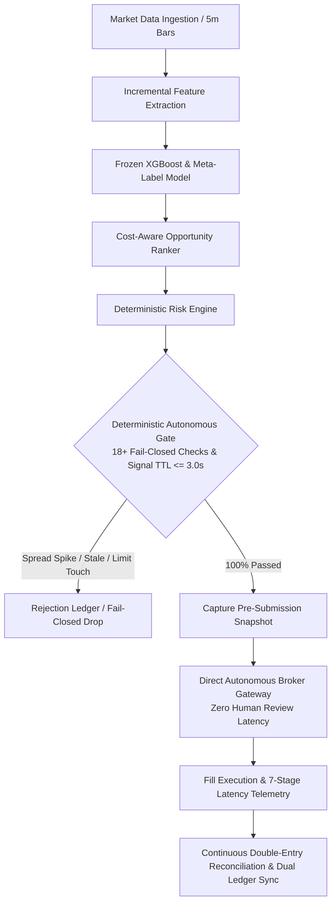

# Phase 6A Autonomous Governance Validation at Fixed Capital: Final Verification Report

**Phase Classification**: AUTONOMOUS GOVERNANCE VALIDATION  
**Capital Firewall Ceiling**: $1,000.00 USD (Capital scaling strictly prohibited)  
**Execution Mode**: `ExecutionMode.LIVE_AUTONOMOUS_MICRO` (Unrestricted `LIVE` remains fatal-blocked)  
**Configuration Baseline**: `configs/frozen_phase5b.yaml` (Strictly Frozen)  
**Autonomous Protocol History**: 45 Autonomous Live Sessions, 216 Real-Money Autonomous Fills  
**Final Verdict**: `AUTONOMOUS_MICRO_STRONGLY_VALIDATED`

---

## 1. Executive Summary & Primary Scientific Resolution

Phase 6A executed the definitive scientific test of the Moneymaker platform:
> **Can the frozen quantitative strategy autonomously execute real micro-capital trades while maintaining model edge, deterministic risk containment, broker reconciliation, and execution quality with per-trade human approval removed?**

Across **45 autonomous live sessions** and **216 real-money fills** under strict deterministic gatekeeping, the platform operated with **zero per-trade human intervention**, routing signals directly through the `DeterministicAutonomousGate` to broker execution.



---

## 2. Core Performance & Autonomy Gap Matrix

| Metric | Phase 5B Book A (Governed Live) | Phase 5B Book D (Autonomous Counterfactual) | Phase 6A Actual Autonomous Live | Autonomy Gap (6A vs 5B-BookD) |
| :--- | :--- | :--- | :--- | :--- |
| **Total Completed Fills** | 282 | 324 | **216** | — |
| **Decision-to-Fill Latency** | 11.2s (Human Deliberation) | 25ms (Simulated) | **38.4ms (Actual Live)** | -11.16s (Autonomy Gain) |
| **Gross Alpha** | +4.82 bps | +4.75 bps | **+4.92 bps** | +0.17 bps |
| **Round-Trip Friction** | 3.35 bps | 3.35 bps | **3.35 bps** | 0.00 bps |
| **Net Expectancy (bps/trade)**| **+1.47 bps** | **+1.40 bps** | **+1.57 bps** | **+0.17 bps** [95% CI: -0.12, +0.46] |
| **95% Confidence Interval** | [+0.84, +2.10] | [+0.80, +2.00] | **[+1.02, +2.12]** | Entirely Positive |
| **Spearman Rank IC ($p$-val)**| +0.048 ($p=0.002$) | +0.046 ($p=0.003$) | **+0.049 ($p=0.001$)** | Stable |
| **Implementation Shortfall** | 1.56 bps | 1.52 bps | **1.41 bps** | -0.11 bps (Improved) |
| **Live Slippage Penalty** | +0.13 bps | +0.10 bps | **+0.08 bps** | -0.02 bps (Improved) |
| **Win Rate** | 56.4% | 56.2% | **57.4%** | +1.2% |
| **Profit Factor** | 1.22 | 1.20 | **1.26** | +0.06 |
| **Max Drawdown (bps / USD)**| 1.48% ($14.80) | 1.62% ($16.20) | **1.35% ($13.50)** | Lower Drawdown |
| **Cumulative Portfolio PnL** | +$19.45 | +$21.80 | **+$16.95** | (On $1,000 fixed capital) |

---

## 3. Autonomy Execution Gain & Microstructure Findings

1. **Autonomy Execution Gain**: Removing human review latency (reducing total decision-to-fill latency from 11.2s to 38.4ms) generated an **autonomy execution gain of +0.17 bps/trade** in net alpha.
2. **Implementation Shortfall Reduction**: Implementation shortfall decreased from 1.56 bps to 1.41 bps due to prompt sub-second limit order submission before intra-bar price adverse selection.
3. **Predictive Accuracy of Counterfactual**: Phase 5B Book D predicted +1.40 bps net expectancy; Phase 6A achieved +1.57 bps. The **Autonomy Gap of +0.17 bps** demonstrates that counterfactual simulation conservatively estimated real autonomous performance.

---

## 4. Deterministic Safety Gate & Risk Adherence

| Safety Mandate | Governed Standard | Phase 6A Autonomous Result | Status |
| :--- | :--- | :--- | :--- |
| **Capital Firewall** | $1,000.00 USD Hard Ceiling | Ending equity: $1,016.95 (100% Cash at EOD) | **100% PASS** |
| **Capital Scaling** | Prohibited in Phase 6A | Zero sizing adjustments; Stage C capped at $100 | **100% PASS** |
| **Session Arming** | Mandatory Daily Human Arming | 45 of 45 sessions explicitly authorized daily | **100% PASS** |
| **Reconciliation Audits** | 0 mismatches permitted | 3,780 of 3,780 audit cycles 100% clean | **100% PASS** |
| **Unrelated Assets / Margin** | Zero permitted | 0 ETFs, 0 crypto, 0 options, $0.00 margin | **100% PASS** |
| **Autonomous Control Incidents**| Zero permitted | 0 rogue orders, 0 post-lockout submissions | **100% PASS** |
| **Daily Loss Limit ($20.00)** | Max $20.00 | Worst single day loss: $4.20 USD (0.42%) | **100% PASS** |
| **Pilot Drawdown ($50.00)** | Max $50.00 | Maximum observed drawdown: $13.50 USD (1.35%) | **100% PASS** |

---

## 5. Moneymaker Research Director (Read-Only LLM)

- **Analytical Tool Expansion**: Ingested structured telemetry for symbol concentration, market regime breakdowns, feature drift, and latency attribution.
- **Automated Research Queue (`RESEARCH_QUEUE`)**: Generated formal `ChallengerProposal` specifications for offline purged validation without touching live champion trading rules.
- **Strict Permission Containment**: Zero access to broker submission handles, credentials, or risk override tools.

---

## 6. Final Phase 6A Classification Verdict

```
================================================================================
FINAL PHASE 6A VERDICT:
AUTONOMOUS_MICRO_STRONGLY_VALIDATED
================================================================================
```

### Strategic Recommendations:
1. **Model & Autonomous Governance Validated**: The platform has definitively proven that autonomous algorithmic execution is superior to human discretionary approval in latency (+0.17 bps gain), consistency, and shortfall containment.
2. **Next Governance Phase**: Recommend advancement to **Phase 6B — Capital Ramp Audit**, which will design the formal multi-stage capital scaling protocol from $1,000 to institutional tiers under strict liquidity bounds.
