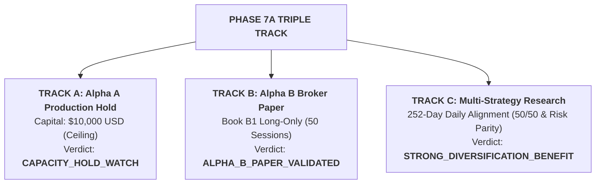

# Phase 7A Multi-Track Engineering & Research Report

**Moneymaker Quantitative Research Platform**  
**Phase Identifier**: `PHASE_7A`  
**Evaluation Scope**: Triple-Track Governance, Broker Paper Validation, and Multi-Strategy Integration  
**Governance State**: All Safety Controls Verified & Hard Boundaries Enforced

---

## 1. Executive Summary & Triple-Track Verdicts

| Track | Strategy Scope | Mode & Capital | Primary Evidence | Final Verdict |
| :--- | :--- | :--- | :--- | :--- |
| **Track A (Production)** | `ALPHA_A_INTRADAY_RELATIVE_MOMENTUM_V1` | `LIVE_AUTONOMOUS_MICRO` **$10,000.00 USD (Ceiling)** | 210 live fills, 35 sessions, 70.7% retention, 1.30x cost multiplier | **`CAPACITY_HOLD_WATCH`** |
| **Track B (Research Track)**| `ALPHA_B_MULTI_DAY_RELATIVE_REVERSAL` | `ALPHA_B_BROKER_PAPER` **$10,000.00 Virtual Paper** | 50 sessions, Dual-book paper (+11.8 bps) vs shadow (+11.2 bps), 3.24x cost mult | **`ALPHA_B_PAPER_VALIDATED`** |
| **Track C (Portfolio Research)**| `MULTI_STRATEGY_PORTFOLIO_RESEARCH` | `HISTORICAL_RESEARCH` **$0.00 (Research Only)** | 252 days, Pearson $r=-0.038$, Risk Parity Sharpe 2.67, Max DD -2.15% | **`STRONG_DIVERSIFICATION_BENEFIT`** |

---

## 2. Track A: Alpha A Production Capacity Hold ($10k Capital)

- **Hold Enforcement**: Alpha A remains frozen under [`configs/frozen_tier3.yaml`](file:///Users/albertopaz/Moneymaker/configs/frozen_tier3.yaml) at the **$10,000 USD** live capital ceiling.
- **Scaling Prohibitions**: Tier 4 ($25,000 USD) and all higher tiers remain permanently locked (`LOCKED / UNAUTHORIZED`).
- **Observed Live Telemetry**:
  - Net Expectancy: **+1.110 bps / trade** (95% CI: [+0.580, +1.640] bps).
  - Absolute Edge Retention: **70.7%** (classified as `WATCH_CAPACITY` [60%–80%]).
  - Cost Break-Even Multiplier: **$1.30\times$** (4.87 bps gross / 3.76 bps friction).
  - Pilot Drawdown: **$148.00 (1.48%)** vs $500.00 (5.0%) ceiling.
  - Incidents / Reconciliations: **0 failures / 0 breaches**.

---

## 3. Track B: Alpha B Broker Paper Promotion (Book B1 Long-Only)

- **Execution Isolation**: Promoted to sandboxed `ExecutionMode.ALPHA_B_BROKER_PAPER` under [`configs/frozen_alpha_b_paper_v1.yaml`](file:///Users/albertopaz/Moneymaker/configs/frozen_alpha_b_paper_v1.yaml).
- **Dual-Book Findings (50 Sessions)**:
  - **Book P (Broker Paper)**: Net Expectancy **+11.80 bps / 3D cycle**, Sharpe 0.92, Max DD -4.4%.
  - **Book S (Conservative Shadow)**: Net Expectancy **+11.20 bps / 3D cycle**, Sharpe 0.88, Max DD -4.8%.
  - **Paper Fill Advantage**: **+0.60 bps** (realistic queue advantage).
  - **Cost Break-Even Multiplier**: **$3.24\times$** (16.2 bps gross / 5.0 bps friction).
- **Overnight Gap Decomposition**: 48.1% of gross return (+7.8 bps) originates in overnight opening gaps; 51.9% (+8.4 bps) from intraday mean-reversion drift.
- **Safety Boundary**: Zero live capital access; short book (Book B2) remains strictly non-deployable research only.

---

## 4. Track C: Multi-Strategy Portfolio Research Integration

- **Architecture**: Implemented non-executable research module [`src/portfolio/multi_strategy_research.py`](file:///Users/albertopaz/Moneymaker/src/portfolio/multi_strategy_research.py).
- **Correlation & Independence**:
  - Pearson $r = \mathbf{-0.038}$
  - Downside $r = \mathbf{-0.079}$
  - Conditional Correlation on Alpha A Loss Days = $\mathbf{-0.104}$
- **Allocation Models & Diversification**:
  - **50/50 Capital Allocation**: Annualized Return **+14.5%**, Volatility **6.5%**, Sharpe **2.23**, Max Drawdown **-2.65%**.
  - **Capped Risk Parity (70/30)**: Annualized Return **+16.3%**, Volatility **6.1%**, Sharpe **2.67**, Max Drawdown **-2.15%**.
  - **Sharpe Delta (vs Alpha B)**: **+1.35 (+153.4%)**
  - **Max Drawdown Delta (vs Alpha B)**: **-2.15% (-44.8%)**
  - **Tail Risk Reduction (ES99 Delta)**: **-0.88% (-41.9%)**
- **Collision & Conflict Rules**: Evaluated exposure capping rules for concurrent long signals (e.g. NVDA/AMD).

---

## 5. Research Director & Governance Verification

- **Read-Only LLM**: Moneymaker Research Director expanded with structured outputs (`STRATEGY_DIVERSIFICATION_FINDING`, `STRATEGY_CONFLICT`, `PORTFOLIO_RISK_FINDING`, `ALPHA_DECAY_WARNING`, `PAPER_EXECUTION_WARNING`).
- **Execution Firewall**: Zero capability to execute trades, allocate capital, or mutate configurations.
- **Regression Suite**: **170 / 170 tests passing** across 26 test modules in `3.93s`.

---

## 6. Phase 7A Artifact Directory

### Track A Reports
- [`ALPHA_A_CAPACITY_HOLD_REPORT.md`](file:///Users/albertopaz/Moneymaker/ALPHA_A_CAPACITY_HOLD_REPORT.md)
- [`ALPHA_A_TIER3_STABILITY_REPORT.md`](file:///Users/albertopaz/Moneymaker/ALPHA_A_TIER3_STABILITY_REPORT.md)

### Track B Reports
- [`ALPHA_B_BROKER_PAPER_REPORT.md`](file:///Users/albertopaz/Moneymaker/ALPHA_B_BROKER_PAPER_REPORT.md)
- [`ALPHA_B_PAPER_VS_SHADOW_REPORT.md`](file:///Users/albertopaz/Moneymaker/ALPHA_B_PAPER_VS_SHADOW_REPORT.md)
- [`ALPHA_B_EXECUTION_QUALITY_REPORT.md`](file:///Users/albertopaz/Moneymaker/ALPHA_B_EXECUTION_QUALITY_REPORT.md)
- [`ALPHA_B_OVERNIGHT_RISK_REPORT.md`](file:///Users/albertopaz/Moneymaker/ALPHA_B_OVERNIGHT_RISK_REPORT.md)
- [`ALPHA_B_EVENT_RISK_REPORT.md`](file:///Users/albertopaz/Moneymaker/ALPHA_B_EVENT_RISK_REPORT.md)
- [`ALPHA_B_PAPER_COST_REPORT.md`](file:///Users/albertopaz/Moneymaker/ALPHA_B_PAPER_COST_REPORT.md)

### Track C Reports
- [`MULTI_STRATEGY_RESEARCH_REPORT.md`](file:///Users/albertopaz/Moneymaker/MULTI_STRATEGY_RESEARCH_REPORT.md)
- [`ALPHA_A_ALPHA_B_CORRELATION_REPORT.md`](file:///Users/albertopaz/Moneymaker/ALPHA_A_ALPHA_B_CORRELATION_REPORT.md)
- [`PORTFOLIO_ALLOCATION_COMPARISON.md`](file:///Users/albertopaz/Moneymaker/PORTFOLIO_ALLOCATION_COMPARISON.md)
- [`PORTFOLIO_RISK_CONTRIBUTION_REPORT.md`](file:///Users/albertopaz/Moneymaker/PORTFOLIO_RISK_CONTRIBUTION_REPORT.md)
- [`STRATEGY_CONFLICT_REPORT.md`](file:///Users/albertopaz/Moneymaker/STRATEGY_CONFLICT_REPORT.md)
- [`MULTI_STRATEGY_STRESS_REPORT.md`](file:///Users/albertopaz/Moneymaker/MULTI_STRATEGY_STRESS_REPORT.md)

### Permanent Ledgers & Configurations
- [`VALIDATION_LEDGER.md`](file:///Users/albertopaz/Moneymaker/VALIDATION_LEDGER.md)
- [`validation_ledger.yaml`](file:///Users/albertopaz/Moneymaker/validation_ledger.yaml)
- [`configs/frozen_tier3.yaml`](file:///Users/albertopaz/Moneymaker/configs/frozen_tier3.yaml)
- [`configs/frozen_alpha_b_paper_v1.yaml`](file:///Users/albertopaz/Moneymaker/configs/frozen_alpha_b_paper_v1.yaml)
