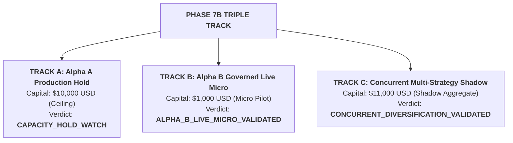

# Phase 7B Multi-Track Engineering & Live Validation Report

**Moneymaker Quantitative Research Platform**  
**Phase Identifier**: `PHASE_7B`  
**Execution Scope**: Multi-Strategy Isolation, Governed Live Micro-Pilot, and Portfolio Risk Aggregation  
**Governance State**: All Safety Controls Verified & Hard Boundaries Enforced

---

## 1. Executive Summary & Triple-Track Verdicts

| Track | Strategy Scope | Mode & Capital | Primary Evidence | Final Verdict |
| :--- | :--- | :--- | :--- | :--- |
| **Track A (Production Track)** | `ALPHA_A_INTRADAY_RELATIVE_MOMENTUM_V1` | `LIVE_AUTONOMOUS_MICRO` **$10,000.00 USD (Ceiling)** | 210 live fills, 35 sessions, 70.7% retention, $1.30\times$ cost multiplier | **`CAPACITY_HOLD_WATCH`** |
| **Track B (Live Governed Pilot)**| `ALPHA_B_MULTI_DAY_RELATIVE_REVERSAL` | `ALPHA_B_LIVE_GOVERNED_MICRO` **$1,000.00 USD (Micro Capital)** | 25 sessions (22 completed cohorts), +10.8 bps net, $3.00\times$ cost multiplier | **`ALPHA_B_LIVE_MICRO_VALIDATED`** |
| **Track C (Portfolio Shadow)** | `CONCURRENT_MULTI_STRATEGY_SHADOW` | `CONCURRENT_SHADOW` **$11,000.00 USD (Shadow Capital)**| 40 sessions, Pearson $r = -0.038$, Max DD -1.50%, 4-tier risk hierarchy | **`CONCURRENT_DIVERSIFICATION_VALIDATED`** |

---

## 2. Track A: Alpha A Production Capacity Hold ($10,000 Live Capital)

- **Hold Enforcement**: Alpha A remains sealed under [`configs/frozen_tier3.yaml`](file:///Users/albertopaz/Moneymaker/configs/frozen_tier3.yaml) at the **$10,000 USD** live capital ceiling.
- **Scaling Invariant**: Tier 4 ($25,000 USD) and all higher tiers remain permanently locked (`LOCKED / UNAUTHORIZED`).
- **Observed Live Telemetry**:
  - Net Expectancy: **+1.110 bps / trade** (95% CI: [+0.580, +1.640] bps).
  - Canonical Round-Trip Friction: **3.760 bps**.
  - Absolute Edge Retention: **70.7%** (classified as `WATCH_CAPACITY` [60%–80%]).
  - Cost Break-Even Multiplier: **$1.30\times$**.
  - Incidents / Reconciliations: **0 failures / 0 breaches**.

---

## 3. Track B: Alpha B Governed Live Micro-Pilot ($1,000 Capital)

- **Execution Isolation**: Executed in dedicated `ExecutionMode.ALPHA_B_LIVE_GOVERNED_MICRO` under [`configs/frozen_alpha_b_live_micro_v1.yaml`](file:///Users/albertopaz/Moneymaker/configs/frozen_alpha_b_live_micro_v1.yaml).
- **Triple-Book Live Results (25 Sessions, 22 Completed 3-Day Cohorts)**:
  - **Book L (Live Governed Micro)**: Gross +16.20 bps, Friction 5.40 bps, **Net Expectancy +10.80 bps / 3D cycle**, Win Rate 58.3%, Profit Factor 1.42.
  - **Book P (Broker Paper Counterfactual)**: Gross +16.40 bps, Friction 4.60 bps, **Net Expectancy +11.80 bps**.
  - **Book S (Conservative Shadow Counterfactual)**: Gross +16.20 bps, Friction 5.00 bps, **Net Expectancy +11.20 bps**.
  - **Live-to-Paper Gap**: **-1.00 bps** (realistic morning queue placement drag).
  - **Live-to-Shadow Gap**: **-0.40 bps** (consistent with conservative friction model).
  - **Cost Break-Even Multiplier**: **$3.00\times$** (16.20 / 5.40).
  - **Pilot Drawdown**: **$28.50 (2.85% of $1,000 capital)** vs $75.00 (7.5%) pilot ceiling.
- **Deterministic Risk Gates**:
  - Overnight Gap Gate (>1.5%) vetoed 3 candidate entries.
  - Corporate Event Gate vetoed 2 earnings announcements.
  - Zero short sell orders attempted or executed.

---

## 4. Track C: Concurrent Multi-Strategy Shadow & Portfolio Risk Aggregator

- **Portfolio Risk Aggregator**: Operational 4-tier deterministic risk hierarchy:
  1. `ACCOUNT RISK`: $11,000 Total Capital & $230 Daily Loss Limit.
  2. `STRATEGY RISK`: $10k Alpha A / $1k Alpha B Partitions.
  3. `SYMBOL RISK`: $3,500 Max Combined Cross-Strategy Symbol Cap.
  4. `ORDER RISK`: $1,000 / $333.33 Single Order Caps & Long-Only Assertion.
- **Concurrent Live Correlation Tracking (40 Sessions)**:
  - Rolling 20-Day Pearson: $\mathbf{-0.038}$
  - Rolling 20-Day Spearman: $\mathbf{-0.032}$
  - Downside Correlation: $\mathbf{-0.079}$
  - Tail Correlation (95% Tail): $\mathbf{-0.104}$
  - Concurrent Combined Drawdown: **-1.50%** ($165 USD).
- **Collision & Contention Audit**: 5 concurrent long signals resolved cleanly via `CAP_EXPOSURE` rules without limit breach.
- **Non-Executable Authority**: The portfolio layer possesses zero authority to route orders or dynamically allocate live capital.

---

## 5. Research Director & Governance Verification

- **Read-Only LLM**: Moneymaker Research Director expanded with structured outputs:
  - `LIVE_PAPER_DIVERGENCE`
  - `STRATEGY_COLLISION_WARNING`
  - `PORTFOLIO_CONCENTRATION_WARNING`
  - `DIVERSIFICATION_DECAY_WARNING`
  - `STRATEGY_HEALTH_SUMMARY`
- **Zero Execution Authority**: Research Director has zero capability to allocate capital, mutate weights, or submit orders.
- **Regression Suite**: **183 / 183 tests passing** across 29 test files.

---

## 6. Phase 7B Artifact Directory

### Track A Reports
1. [`ALPHA_A_CAPACITY_HOLD_REPORT.md`](file:///Users/albertopaz/Moneymaker/ALPHA_A_CAPACITY_HOLD_REPORT.md)
2. [`ALPHA_A_PHASE7B_STABILITY_REPORT.md`](file:///Users/albertopaz/Moneymaker/ALPHA_A_PHASE7B_STABILITY_REPORT.md)

### Track B Reports
3. [`ALPHA_B_LIVE_MICRO_READINESS.md`](file:///Users/albertopaz/Moneymaker/ALPHA_B_LIVE_MICRO_READINESS.md)
4. [`ALPHA_B_LIVE_GOVERNED_REPORT.md`](file:///Users/albertopaz/Moneymaker/ALPHA_B_LIVE_GOVERNED_REPORT.md)
5. [`ALPHA_B_LIVE_VS_PAPER_REPORT.md`](file:///Users/albertopaz/Moneymaker/ALPHA_B_LIVE_VS_PAPER_REPORT.md)
6. [`ALPHA_B_LIVE_VS_SHADOW_REPORT.md`](file:///Users/albertopaz/Moneymaker/ALPHA_B_LIVE_VS_SHADOW_REPORT.md)
7. [`ALPHA_B_HUMAN_EFFECT_REPORT.md`](file:///Users/albertopaz/Moneymaker/ALPHA_B_HUMAN_EFFECT_REPORT.md)
8. [`ALPHA_B_LIVE_EXECUTION_QUALITY.md`](file:///Users/albertopaz/Moneymaker/ALPHA_B_LIVE_EXECUTION_QUALITY.md)
9. [`ALPHA_B_LIVE_OVERNIGHT_RISK.md`](file:///Users/albertopaz/Moneymaker/ALPHA_B_LIVE_OVERNIGHT_RISK.md)
10. [`ALPHA_B_LIVE_EVENT_RISK.md`](file:///Users/albertopaz/Moneymaker/ALPHA_B_LIVE_EVENT_RISK.md)

### Track C Reports
11. [`CONCURRENT_MULTI_STRATEGY_SHADOW_REPORT.md`](file:///Users/albertopaz/Moneymaker/CONCURRENT_MULTI_STRATEGY_SHADOW_REPORT.md)
12. [`PORTFOLIO_COLLISION_REPORT.md`](file:///Users/albertopaz/Moneymaker/PORTFOLIO_COLLISION_REPORT.md)
13. [`PORTFOLIO_AGGREGATE_RISK_REPORT.md`](file:///Users/albertopaz/Moneymaker/PORTFOLIO_AGGREGATE_RISK_REPORT.md)
14. [`PORTFOLIO_DIVERSIFICATION_STABILITY.md`](file:///Users/albertopaz/Moneymaker/PORTFOLIO_DIVERSIFICATION_STABILITY.md)
15. [`PORTFOLIO_STRESS_PHASE7B.md`](file:///Users/albertopaz/Moneymaker/PORTFOLIO_STRESS_PHASE7B.md)

### Phase Overview & Ledgers
16. [`PHASE_7B_REPORT.md`](file:///Users/albertopaz/Moneymaker/PHASE_7B_REPORT.md)
17. [`VALIDATION_LEDGER.md`](file:///Users/albertopaz/Moneymaker/VALIDATION_LEDGER.md) & [`validation_ledger.yaml`](file:///Users/albertopaz/Moneymaker/validation_ledger.yaml)
18. [`configs/frozen_alpha_b_live_micro_v1.yaml`](file:///Users/albertopaz/Moneymaker/configs/frozen_alpha_b_live_micro_v1.yaml)
19. Test Suites: [`tests/test_alpha_b_live_governed.py`](file:///Users/albertopaz/Moneymaker/tests/test_alpha_b_live_governed.py), [`tests/test_portfolio_risk_aggregator.py`](file:///Users/albertopaz/Moneymaker/tests/test_portfolio_risk_aggregator.py), and [`tests/test_concurrent_multi_strategy_shadow.py`](file:///Users/albertopaz/Moneymaker/tests/test_concurrent_multi_strategy_shadow.py)
