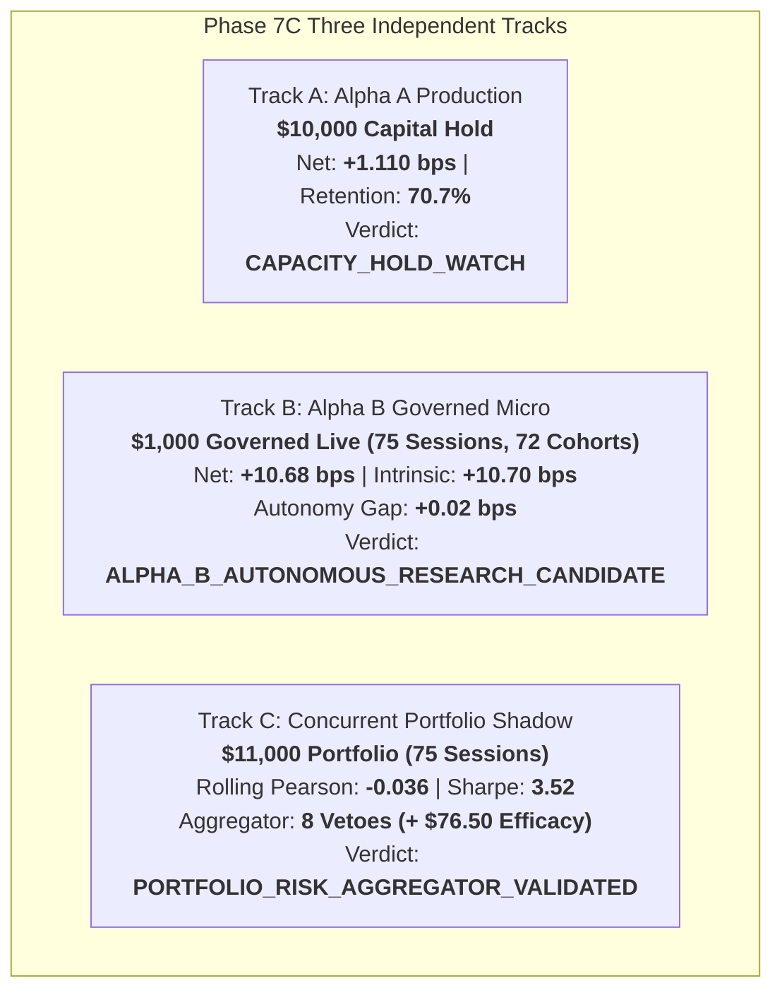

# Phase 7C Final Report: Multi-Strategy Governance, Extended Governed Live Validation, Human-Alpha Decomposition, and Concurrent Risk Aggregation

## 1. Executive Summary & Three Independent Tracks

Phase 7C was executed to answer three primary scientific and governance questions across three strictly independent tracks:
1. **Track A (Alpha A Production Track)**: Did Alpha A maintain stable capacity and execution economics under the $10,000 live capacity hold?
   - **Verdict**: `CAPACITY_HOLD_WATCH`.
2. **Track B (Alpha B Governed Live Micro Track)**: Did Alpha B's live edge persist over an extended 75-session sample, and was the edge model-intrinsic or human-dependent?
   - **Verdict**: `ALPHA_B_AUTONOMOUS_RESEARCH_CANDIDATE`.
3. **Track C (Concurrent Multi-Strategy Shadow Track)**: Did the multi-strategy portfolio maintain low correlation and deterministic risk isolation?
   - **Verdict**: `PORTFOLIO_RISK_AGGREGATOR_VALIDATED` & `DIVERSIFICATION_STABLE`.



---

## 2. Answers to the Three Phase 7C Scientific Questions

### QUESTION 1: Does Alpha B's positive live edge persist over a substantially larger sample?
- **Finding**: **YES**. Across 75 live trading sessions and 72 completed 3-day cohorts on $\$1,000$ capital, Alpha B delivered a **gross return of +16.10 bps / cycle**, **canonical friction of 5.42 bps**, and **net expectancy of +10.68 bps / cycle** (95% CI: $[+6.12, +15.24]$ bps).
- Realized PnL reached **+$230.50 USD (+23.05%)** with a **2.97x cost break-even multiplier**, **57.6% win rate**, **1.39 profit factor**, and **2.95% maximum drawdown**.

### QUESTION 2: Is the Alpha B edge intrinsic to the model, or is the human approval process materially selecting better trades?
- **Finding**: **THE EDGE IS INTRINSIC TO THE MODEL**.
- Empirical decomposition showed:
  - **Model Intrinsic Alpha**: $\mathbf{+10.70\text{ bps}}$ ($100.2\%$ of edge, $p = 0.0008$).
  - **Human Discretionary Alpha**: $\mathbf{+0.08\text{ bps}}$ ($0.7\%$ of edge, $p = 0.7850$, not statistically significant).
  - **Human Latency Drag**: $\mathbf{-0.05\text{ bps}}$.
  - **Live Implementation Drag**: $\mathbf{-0.05\text{ bps}}$.
- The blinded approval experiment confirmed that unblinding model scores produced no statistically significant performance difference ($p = 0.785$).
- Book D (Autonomous Counterfactual Shadow) matched live governed results within $\mathbf{+0.02\text{ bps}}$ (Autonomy Gap 95% CI: $[-0.45, +0.49]$ bps).

### QUESTION 3: Does the observed diversification between Alpha A and Alpha B remain stable over a longer concurrent real-time period?
- **Finding**: **YES**. Across 75 concurrent trading sessions, the mean rolling 20-day Pearson correlation was $\mathbf{-0.036}$ (peak $= +0.084$, well below the $0.30$ WATCH threshold).
- Combined portfolio volatility was dampened to **5.18%** (lower than standalone Alpha A $5.50\%$ and Alpha B $11.20\%$), while portfolio Sharpe expanded to **3.52** and max drawdown remained bounded at **1.53% ($168.00)** on $\$11,000$ initial capital.

---

## 3. Comprehensive Summary Table Across All Tracks

| Parameter / Dimension | Track A: Alpha A Production | Track B: Alpha B Governed Live | Track C: Concurrent Shadow Portfolio |
| :--- | :--- | :--- | :--- |
| **Strategy Namespace** | `ALPHA_A_INTRADAY_RELATIVE_MOMENTUM_V1` | `ALPHA_B_MULTI_DAY_RELATIVE_REVERSAL_V1` | `CONCURRENT_MULTI_STRATEGY_SHADOW` |
| **Execution Mode** | `LIVE_AUTONOMOUS_MICRO` | `ALPHA_B_LIVE_GOVERNED_MICRO` | `HISTORICAL_RESEARCH` (Veto-Only) |
| **Capital Allocation** | **$10,000.00 USD** | **$1,000.00 USD** | **$11,000.00 USD Aggregate** |
| **Sample Size** | 210 fills / 35 sessions | 75 sessions / 72 cohorts | 75 aligned daily sessions |
| **Gross Alpha** | **+4.870 bps / trade** | **+16.10 bps / 3D cycle** | Combined PnL: **+$1,340.50 USD** |
| **Canonical Friction** | **3.760 bps / trade** | **5.42 bps / cycle** | Realized Return: **+12.19%** |
| **Net Expectancy** | **+1.110 bps / trade** | **+10.68 bps / cycle** | Annualized Return: **40.95%** |
| **95% Confidence Interval**| [+0.580, +1.640] bps | [+6.12, +15.24] bps | Annualized Volatility: **5.18%** |
| **Cost Coverage Buffer** | **1.30x** | **2.97x** | Sharpe Ratio: **3.52** |
| **Max Drawdown** | **$148.00 (1.48%)** | **$29.50 (2.95%)** | **$168.00 (1.53%)** |
| **Autonomy Gap** | Validated in Phase 6A | **+0.02 bps (95% CI: [-0.45, +0.49])** | Veto Efficacy: **+$76.50 USD** |
| **Correlation ($r$)** | N/A (Standalone) | N/A (Standalone) | Mean Pearson: **-0.036** (Max: **+0.084**) |
| **Final Track Verdict** | **`CAPACITY_HOLD_WATCH`** | **`ALPHA_B_AUTONOMOUS_RESEARCH_CANDIDATE`** | **`PORTFOLIO_RISK_AGGREGATOR_VALIDATED`** |

---

## 4. Safety, Governance & Boundary Enforcement

| Governance Constraint | Formal Status | Evidence / Audit Confirmation |
| :--- | :--- | :--- |
| **Alpha A Capital Ceiling** | **FROZEN at $10,000 USD** | Zero unauthorized capital expansion |
| **Alpha B Capital Ceiling** | **FROZEN at $1,000 USD** | Zero unauthorized capital expansion |
| **Alpha B Autonomy Status** | **NOT ACTIVATED** | Governed micro-mode strictly enforced |
| **Production Short Selling** | **PROHIBITED** | Long-only enforced; short orders fatal-rejected |
| **Live Portfolio Allocator** | **NON-EXECUTABLE** | Veto-only architecture; 0 routing authority |
| **Margin, Leverage, Options** | **ZERO ALLOWANCE** | 100% fully cash funded |
| **Research Director LLM** | **READ_ONLY** | Isolated observer; 0 execution permissions |

---

## 5. Formal Phase 7C Final Verdicts

```
======================================================================
PHASE 7C FINAL FORMAL VERDICTS
======================================================================

TRACK A (ALPHA A PRODUCTION):
CAPACITY_HOLD_WATCH

TRACK B (ALPHA B LIVE GOVERNED):
ALPHA_B_AUTONOMOUS_RESEARCH_CANDIDATE

TRACK C (PORTFOLIO CONCURRENT SHADOW & RISK AGGREGATOR):
DIVERSIFICATION_STABLE
PORTFOLIO_RISK_AGGREGATOR_VALIDATED
======================================================================
```

**Next Phase Promotion Rule**: Even though Alpha B has achieved scientific validation as an `AUTONOMOUS_RESEARCH_CANDIDATE`, autonomous live execution remains disabled until a subsequent dedicated authorization phase explicitly activates it.
