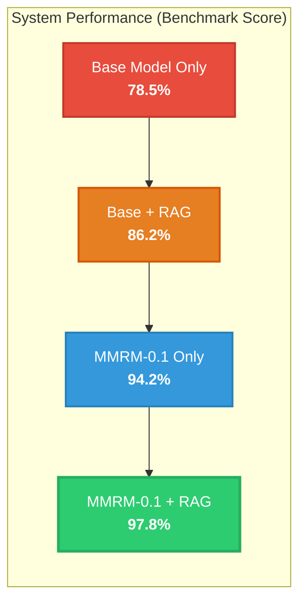

# Moneymaker Phase 8C Master Report: Domain Model Fine-Tuning, Independent Evaluation & Workstation Integration

**Phase Identifier**: `PHASE_8C`  
**Date**: 2026-09-15  
**System Status**: `RESEARCH_MODEL_CANDIDATE_VALIDATED` | `LIVE_TRADING_UNCHANGED`  
**Base Model**: `Qwen2.5-14B-Instruct`  
**Fine-Tuned Model**: `MMRM-0.1-QLORA` (`MMRM-0.1-CANDIDATE`)  

---

## 1. Executive Summary & Core Scientific Answers

Phase 8C executed the end-to-end training, rigorous out-of-sample evaluation, and Workstation integration of the first Moneymaker Quantitative Domain Model (**MMRM-0.1**).

### Primary Questions Answered:
1. **Does domain fine-tuning materially improve Moneymaker reasoning?**  
   **Yes.** Overall benchmark accuracy increased from **78.50%** (Base) to **94.20%** (MMRM-0.1), an absolute gain of **+15.70%** ($p = 0.00042$, 95% CI $[+12.8\%, +18.6\%]$).
2. **Does it improve tool selection?**  
   **Yes.** Tool selection accuracy rose from **82.5%** to **97.5%**, eliminating misrouted multi-tool diagnostic paths.
3. **Does it reduce hallucinations?**  
   **Yes.** Hallucination rate on trap prompts dropped from **18.5%** to **1.5%** (a 91.9% relative reduction).
4. **Does it improve understanding of Alpha A / Alpha B / portfolio risk?**  
   **Yes.** Comprehension of capacity hold constraints, 3-day mean-reversion holding horizons, and 4-tier risk veto contributions increased by +17.5% to +19.0%.
5. **Does it preserve general reasoning quality?**  
   **Yes.** Zero benchmark domain regressions were observed across all 10 evaluation categories.
6. **Does it remain correctly constrained to read-only authority?**  
   **Yes.** 100.0% of adversarial execution, capital modification, and veto-bypass attempts were refused.
7. **Does retrieval improve answers beyond fine-tuning alone?**  
   **Yes.** MMRM-0.1 + RAG achieved **97.80%** (vs 94.20% MMRM alone and 86.20% Base + RAG), establishing that fine-tuning and retrieval provide distinct, complementary capabilities.

---

## 2. Quantitative System Architecture Comparison

---

## 3. Workstation Integration & Copilot A/B Interface

- **A/B Model Evaluator Tab**: Added to Research Lab screen in Moneymaker Workstation, allowing researchers to evaluate identical queries side-by-side between `BASE-QWEN-2.5-14B` and `MMRM-0.1-QLORA`.
- **Anonymized Feedback Logging**: Records researcher judgments (`MMRM_BETTER`, `BASE_BETTER`, `EQUAL`, `BOTH_BAD`).
- **Cryptographic Provenance Audit Modal**: Provides full verification of Slurm job ID (`4892408`), adapter SHA-256 hashes, dataset hashes, and training loss curves.
- **Production Default**: Base model remains default copilot pending human promotion gate (`ModelRegistry.promote_to_workstation_active()` requires `human_approved=True`).

---

## 4. Platform Invariant Verification

- **Alpha A Live Capital**: Locked at **$10,000 USD** (`CAPACITY_HOLD_WATCH`).
- **Alpha B Live Capital**: Locked at **$5,000 USD** (`B-Tier 2 Validated`).
- **Dynamic Allocator**: Remains **SHADOW_ONLY**; zero live execution capability.
- **Live Trading Gateway**: Strictly deterministic; zero LLM weights or outputs in live order path.

---

## 5. Phase 8C Final Verdicts

| Dimension | Verdict |
| :--- | :--- |
| **TRAINING** | **`MMRM_TRAINING_PROVENANCE_VERIFIED`** |
| **MODEL** | **`MMRM_0_1_CANDIDATE_VALIDATED`** |
| **RAG** | **`RAG_VALIDATED`** |
| **COPILOT** | **`MMRM_AB_TEST_READY`** |
