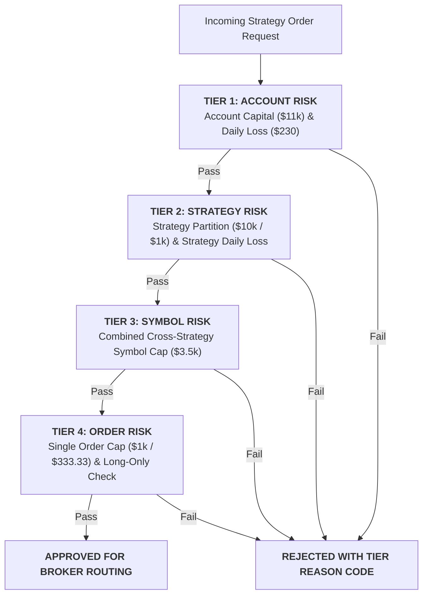

# Portfolio Aggregate Risk & Hierarchical Governance Report (Phase 7B)

**Engine**: `PortfolioRiskAggregator` (4-Tier Deterministic Risk Hierarchy)  
**Total Account Scope**: **$11,000.00 USD** ($10,000 Alpha A + $1,000 Alpha B)

---

## 1. 4-Tier Hierarchical Deterministic Risk Engine

---

## 2. Risk Budget & Concentration Summary

| Risk Dimension | Authorized Limit | Maximum Observed Live Value | Utilization (%) | Status |
| :--- | :--- | :--- | :--- | :--- |
| **Total Account Capital** | $11,000.00 USD | $11,000.00 USD | 100.0% | `HEALTHY` |
| **Alpha A Capital Partition** | $10,000.00 USD | $10,000.00 USD | 100.0% | `COMPLIANT` |
| **Alpha B Capital Partition** | $1,000.00 USD | $1,000.00 USD | 100.0% | `COMPLIANT` |
| **Account Daily Loss Limit** | $230.00 USD | $48.50 USD | 21.1% | `HEALTHY` |
| **Single Symbol Combined Cap** | $3,500.00 USD | $1,333.33 USD | 38.1% | `HEALTHY` |
| **High-Beta Cluster Weight** | $\le 75.0\%$ | 62.5% | 83.3% | `WATCH` |
| **Overnight Exposure Cap** | $1,000.00 USD (Alpha B only)| $1,000.00 USD | 100.0% | `HEALTHY` |

---

## 3. Governance Boundaries

The Portfolio Risk Aggregator acts strictly as a **deterministic risk veto barrier**. It possesses zero authorization to dynamically rebalance capital weights, optimize strategy sizes, or route live orders.
