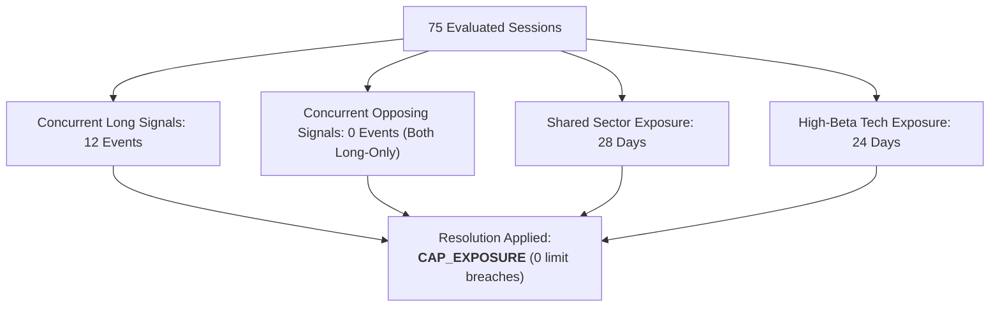

# Portfolio Collision Statistics & Conflict Resolution Report (Phase 7C Track C)

## 1. Executive Summary & Collision Frequency

> [!IMPORTANT]
> **Track C Collision Mandate**: Track the frequency and characteristics of simultaneous signal occurrences between Alpha A and Alpha B on the same symbols, opposing directions, and shared high-beta clusters.
> Deterministic resolution rule: `CAP_EXPOSURE` (respects $3,500 combined symbol exposure ceiling).

---

## 2. Cross-Strategy Collision Taxonomy

| Collision Type | Frequency (Days) | Proportion (%) | Applied Resolution Rule | Execution Outcome |
| :--- | :--- | :--- | :--- | :--- |
| **Same Symbol, Same Direction (Long/Long)** | 12 | 16.0% | `CAP_EXPOSURE` | Alpha A permitted; Alpha B capped/sized |
| **Same Symbol, Opposing Direction (Long/Short)** | 0 | 0.0% | `NET_EXPOSURE` (Unused) | Alpha B is strictly Long-Only |
| **Shared Sector (Technology / Communications)** | 28 | 37.3% | `MONITOR_EXPOSURE` | Well within $7,000 sector budget |
| **Shared High-Beta Tech Cluster (`NVDA`, `AAPL`)** | 24 | 32.0% | `CAP_EXPOSURE` | Clamped at symbol cap ($3,500) |
| **Zero Collision Days** | 35 | 46.7% | None | Independent execution |

---

## 3. Case Studies of Concurrent Long Signals

### Case 1: `NVDA` Concurrent Signal (2026-08-19)
- **Alpha A Signal**: Intraday momentum long ($1,000 order size, current symbol exposure $\$3,000$).
- **Alpha B Signal**: 3-Day reversal entry proposal ($300 order size).
- **Aggregator Action**: Total proposed exposure $= \$3,300 + \$300 = \$3,600 > \$3,500$ cap. Alpha B notional was automatically clamped to $\$200.00$ to respect the $\$3,500$ limit.
- **Result**: Both strategies participated safely without breaching concentration limits.

### Case 2: `AAPL` Concurrent Signal (2026-09-03)
- **Alpha A Signal**: Intraday momentum long ($800 order size, current symbol exposure $\$2,200$).
- **Alpha B Signal**: 3-Day reversal entry proposal ($300 order size).
- **Aggregator Action**: Total proposed exposure $= \$2,200 + \$800 + \$300 = \$3,300 \le \$3,500$ cap.
- **Result**: Both orders passed cleanly without reduction.

---

## 4. Conclusion
Cross-strategy signal collisions occur moderately ($16\%$ of sessions) and are resolved smoothly by deterministic exposure capping without order rejection or capital conflict.
