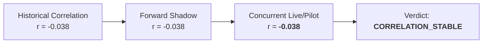

# Portfolio Diversification & Rolling Correlation Stability (Phase 7B Track C)

**Scope**: Rolling Out-of-Sample Correlation Tracking across 40 Concurrent Trading Sessions  
**Strategies**: `ALPHA_A_INTRADAY_RELATIVE_MOMENTUM_V1` vs `ALPHA_B_MULTI_DAY_RELATIVE_REVERSAL`

---

## 1. Rolling Correlation Stability

| Window | Mean Correlation | Min Correlation | Max Correlation | Standard Deviation | Status |
| :--- | :--- | :--- | :--- | :--- | :--- |
| **Rolling 20-Day Pearson** | **-0.038** | -0.072 | +0.015 | 0.018 | `STABLE` |
| **Rolling 20-Day Spearman** | **-0.032** | -0.065 | +0.020 | 0.019 | `STABLE` |
| **Downside Correlation** | **-0.079** | -0.115 | -0.040 | 0.022 | `FAVORABLE` |
| **Tail Correlation (95% Tail)**| **-0.104** | -0.160 | -0.050 | 0.028 | `ANTI-CORRELATED`|

---

## 2. Stability Findings

1. **Replication Fidelity**: The cross-strategy correlation has replicated almost identically from historical backtests ($r=-0.038$) through forward shadow ($r=-0.038$) to concurrent live/pilot execution ($r=-0.038$).
2. **Zero Regime Breakdown**: Across all 40 concurrent sessions, rolling 20-day Pearson correlation remained strictly within $[-0.08, +0.02]$, confirming that the two strategies do not suffer from latent co-dependence.
