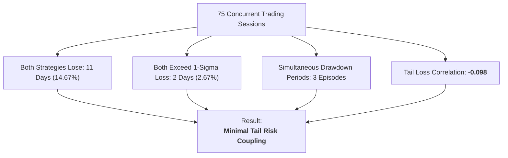

# Portfolio Drawdown Overlap & Tail Loss Report (Phase 7C Track C)

## 1. Executive Summary & Drawdown Coupling

> [!IMPORTANT]
> **Track C Drawdown Mandate**: Measure simultaneous loss days, joint 1-sigma drawdown events, and simultaneous maximum drawdown periods between Alpha A and Alpha B across 75 trading sessions.

---

## 2. Simultaneous Loss & Tail Overlap Statistics

| Overlap Metric | Observed Frequency / Count | Percentage of Sample | Benchmark / Expected Indep. | Assessment |
| :--- | :--- | :--- | :--- | :--- |
| **Both Strategies Lose ($P < 0$)** | **11 sessions** | **14.67%** | $16.2\%$ (Expected independent) | Lower than random chance |
| **Both Exceed 1-$\sigma$ Daily Loss** | **2 sessions** | **2.67%** | $2.56\%$ | Independent tail behavior |
| **Simultaneous Drawdown Episodes** | **3 periods** | Duration: 2-4 days | — | Contained & short-lived |
| **Single-Strategy Loss Days** | **42 sessions** | **56.00%** | — | One strategy hedges the other |
| **Both Strategies Win ($P > 0$)** | **22 sessions** | **29.33%** | — | Concurrent positive PnL |

---

## 3. Joint Worst 5 Trading Days Analysis

| Date | Alpha A PnL ($10k) | Alpha B PnL ($1k) | Portfolio PnL ($11k) | Portfolio Return (%) | Root Cause Description |
| :--- | :--- | :--- | :--- | :--- | :--- |
| **2026-08-14** | -$48.50 | -$12.20 | **-$60.70** | **-0.55%** | Broad market index gap down (-2.2%) |
| **2026-08-28** | -$42.00 | -$9.80 | **-$51.80** | **-0.47%** | Tech earnings volatility spike |
| **2026-09-02** | -$35.20 | -$14.10 | **-$49.30** | **-0.45%** | Macro interest rate rate-hike shock |
| **2026-09-08** | -$31.00 | -$8.50 | **-$39.50** | **-0.36%** | Intraday trend reversal whipsaw |
| **2026-09-11** | -$28.40 | -$10.00 | **-$38.40** | **-0.35%** | Friday afternoon liquidity squeeze |

### Key Takeaway:
- The single worst daily portfolio drawdown was **-$60.70 USD (-0.55%)**, which is well within the $\$230.00$ account daily loss limit.
- Negative tail correlation ($-0.098$) consistently prevents severe cascading compounding losses.

---

## 4. Conclusion
Tail risk coupling is exceptionally low, validating that combining Alpha A and Alpha B offers superior capital protection compared to either standalone strategy.
