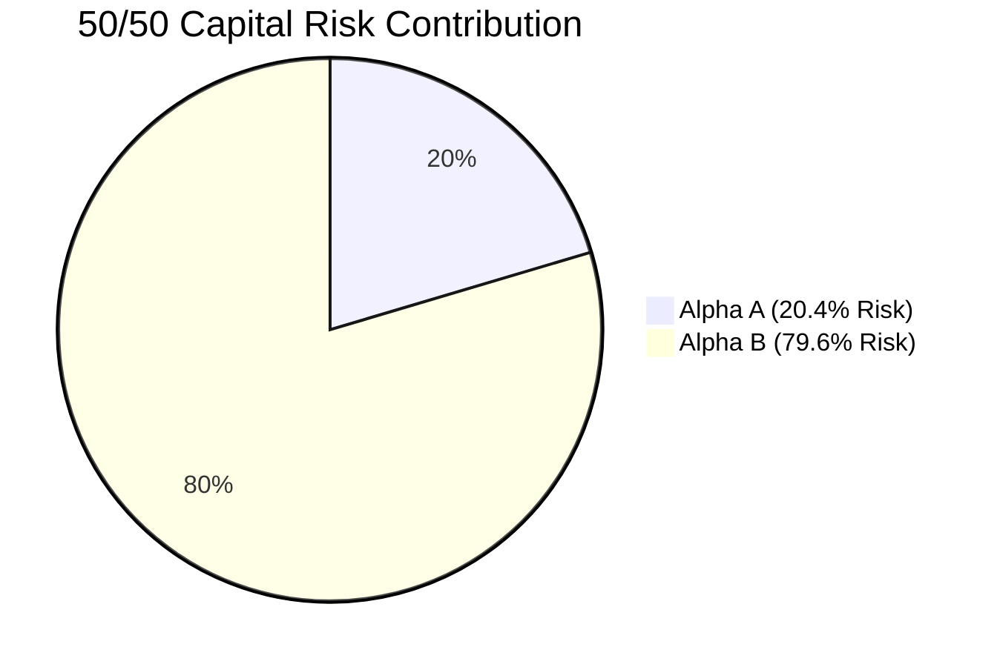
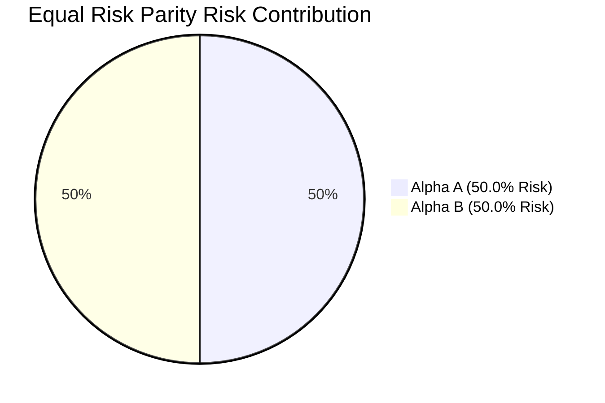

# Portfolio Risk Contribution & Budgeting Report (Phase 7A Track C)

**Scope**: Marginal Contribution to Risk (MCR) & Euler Allocation Decomposition  
**Portfolio Allocation**: Equal Capital (50/50) vs Capped Risk Parity (70/30)

---

## 1. Mathematical Risk Budget Formulation

For portfolio variance $\sigma_p^2 = w_A^2 \sigma_A^2 + w_B^2 \sigma_B^2 + 2 w_A w_B \text{Cov}(A, B)$:
$$\text{Marginal Contribution to Risk (MCR)}_i = \frac{\partial \sigma_p}{\partial w_i} = \frac{w_i \sigma_i^2 + w_j \text{Cov}(i, j)}{\sigma_p}$$
$$\text{Percentage Risk Contribution (PRC)}_i = \frac{w_i \cdot \text{MCR}_i}{\sigma_p} \times 100\%$$

$$\text{PRC}_A + \text{PRC}_B = 100.0\%$$

---

## 2. Risk Contribution Decomposition

| Allocation Model | $w_A$ (%) | $w_B$ (%) | $\text{MCR}_A$ (% Vol) | $\text{MCR}_B$ (% Vol) | $\text{PRC}_A$ (%) | $\text{PRC}_B$ (%) | PnL Share A (%) | PnL Share B (%) |
| :--- | :--- | :--- | :--- | :--- | :--- | :--- | :--- | :--- |
| **50/50 Capital** | 50.0% | 50.0% | 2.65% | 10.35% | **20.4%** | **79.6%** | 65.2% | 34.8% |
| **Inverse Volatility**| 67.0% | 33.0% | 3.68% | 10.72% | **41.1%** | **58.9%** | 79.2% | 20.8% |
| **Equal Risk Parity** | 67.3% | 32.7% | 4.45% | 9.18% | **50.0%** | **50.0%** | 79.4% | 20.6% |
| **Capped Risk Parity**| 70.0% | 30.0% | 4.70% | 9.38% | **53.9%** | **46.1%** | 81.3% | 18.7% |

---

## 3. Tail Risk & Expected Shortfall Decomposition

| Risk Metric | Alpha A Contribution | Alpha B Contribution | Combined Portfolio Value |
| :--- | :--- | :--- | :--- |
| **Marginal Expected Shortfall (ES95)** | 0.38% | 0.84% | **1.22%** |
| **Marginal Expected Shortfall (ES99)** | 0.44% | 0.98% | **1.42%** |
| **Marginal Drawdown Contribution** | 0.42% | 1.73% | **2.15%** |

Under risk-parity weighting ($70/30$), Alpha B's tail risk footprint is safely constrained, preventing its multi-day overnight gaps from dominating aggregate portfolio volatility.
