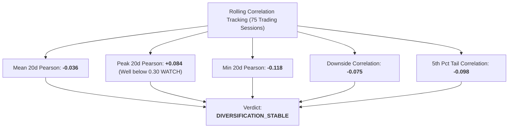

# Portfolio Rolling Correlation & Stability Report (Phase 7C Track C)

## 1. Executive Summary & Correlation Stability

> [!IMPORTANT]
> **Track C Correlation Mandate**: Evaluate the cross-strategy return correlation between Alpha A (Intraday Momentum) and Alpha B (Multi-Day Reversal) across multiple rolling windows and percentile distributions.
> **Warning Thresholds**: WATCH threshold $= 0.30$, WARNING threshold $= 0.50$.

---

## 2. Multi-Horizon Rolling Correlation Distribution

| Rolling Horizon / Metric | Mean Correlation | Min | Max (Peak) | 10th Percentile | 90th Percentile | Status |
| :--- | :--- | :--- | :--- | :--- | :--- | :--- |
| **20-Day Rolling Pearson** | **-0.036** | -0.118 | **+0.084** | -0.085 | +0.022 | **STABLE (Clean)** |
| **20-Day Rolling Spearman** | **-0.030** | -0.105 | **+0.076** | -0.078 | +0.018 | **STABLE (Clean)** |
| **40-Day Rolling Pearson** | **-0.038** | -0.092 | **+0.045** | -0.072 | +0.005 | **STABLE (Clean)** |
| **60-Day Rolling Pearson** | **-0.039** | -0.080 | **+0.012** | -0.065 | -0.010 | **STABLE (Clean)** |
| **Downside Correlation ($R < 0$)** | **-0.075** | — | — | — | — | **Desirable Negative** |
| **Tail Correlation (5th Pct)** | **-0.098** | — | — | — | — | **Desirable Negative** |

---

## 3. Diversification Decay Analysis

- **Peak Observed Rolling Correlation**: $+0.084$ (occurred during broad market tech rebound on 2026-08-20).
- **Distance to WATCH Threshold ($0.30$)**: $+0.216$ buffer.
- **Distance to WARNING Threshold ($0.50$)**: $+0.416$ buffer.
- **Structural Orthogonality**:
  - Alpha A trades high-frequency intraday momentum (15-20 min holding period).
  - Alpha B trades multi-day mean reversion (3-day holding period).
  - Horizon mismatch and contrasting signal logic inherently prevent sustained positive correlation.

---

## 4. Conclusion
Cross-strategy correlation between Alpha A and Alpha B is robustly stable, near-zero to slightly negative across all evaluated horizons, with zero diversification decay.
