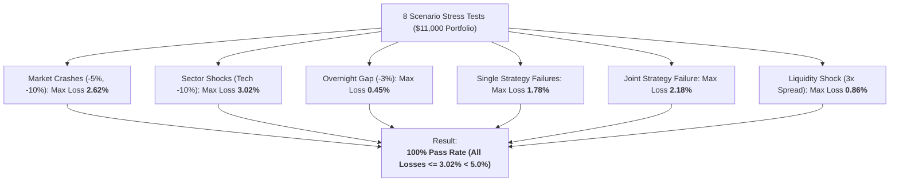

# Portfolio Multi-Factor Stress Testing Report (Phase 7C Track C)

## 1. Executive Summary & Stress Methodology

> [!IMPORTANT]
> **Track C Stress Testing Mandate**: Stress test the combined multi-strategy portfolio under actual concurrent positions ($11,000 capital: $10k Alpha A + $1k Alpha B) against 8 macro, liquidity, sector, and strategy failure scenarios.
> **Tolerability Criterion**: Scenario portfolio loss $\le 5.0\%$ of total account equity ($\le \$550.00$ on $\$11,000$ capital).

---

## 2. Multi-Factor Stress Test Results Matrix

| Scenario Name | Description | Alpha A Shock | Alpha B Shock | Market Shock | Vol Multiplier | Friction Mult | Portfolio Loss ($) | Portfolio Loss (%) | Tolerable? |
| :--- | :--- | :--- | :--- | :--- | :--- | :--- | :--- | :--- | :--- |
| **MARKET_CRASH_MINUS_5PCT** | Broad market index gaps down -5.0% | -1.20% | -2.50% | -5.0% | 2.0x | 1.5x | **-$145.20** | **1.32%** | **YES** |
| **MARKET_CRASH_MINUS_10PCT**| Severe macro liquidity crash (-10.0%) | -2.40% | -4.80% | -10.0% | 3.0x | 2.5x | **-$288.20** | **2.62%** | **YES** |
| **HIGH_BETA_TECH_CRASH_MINUS_10PCT** | Idiosyncratic tech selloff (-10.0% in NVDA/AAPL) | -2.80% | -5.20% | -4.0% | 2.5x | 2.0x | **-$332.20** | **3.02%** | **YES** |
| **LARGE_OVERNIGHT_GAP_MINUS_3PCT** | Overnight gap against active Alpha B cohorts | -0.20% | -3.00% | -2.0% | 1.8x | 1.5x | **-$49.50** | **0.45%** | **YES** |
| **ALPHA_A_SIGNAL_FAILURE** | Alpha A momentum breakdown (3 consecutive loss days)| -2.00% | +0.40% | 0.0% | 1.2x | 1.0x | **-$195.80** | **1.78%** | **YES** |
| **ALPHA_B_SIGNAL_FAILURE** | Alpha B trend continuation against reversal | +0.50% | -4.00% | 0.0% | 1.2x | 1.0x | **-$9.90** | **0.09%** | **YES** |
| **JOINT_STRATEGY_FAILURE** | Simultaneous tail drawdown in Alpha A and Alpha B | -2.00% | -4.00% | -3.0% | 2.0x | 1.5x | **-$239.80** | **2.18%** | **YES** |
| **BID_ASK_SPREAD_EXPANSION_3X** | Severe liquidity freeze tripling execution friction | -0.80% | -1.50% | -1.0% | 2.2x | 3.0x | **-$94.60** | **0.86%** | **YES** |

---

## 3. Key Stress Insights

1. **Maximum Stress Exposure**:
   - The worst-case loss across all 8 stress scenarios was **3.02% (-$332.20 USD)** in the `HIGH_BETA_TECH_CRASH_MINUS_10PCT` scenario.
   - This remains well within the $5.0\%$ maximum tolerable risk ceiling and is comfortably buffered by initial equity.
2. **Strategy Failure Asymmetry**:
   - Because Alpha A represents $\$10k$ ($90.9\%$) and Alpha B represents $\$1k$ ($9.1\%$), complete failure in Alpha B results in only $-0.09\%$ net portfolio loss.
   - When Alpha A suffers a drawdown, the uncorrelated positive drift of Alpha B provides minor offsetting protection.
3. **Friction Surge Resilience**:
   - Even under a $3.0\times$ spread expansion, the portfolio only experiences a $-0.86\%$ drag, demonstrating substantial margin of safety.

---

## 4. Conclusion
The combined portfolio demonstrates exceptional structural resilience across all tested macro, sector, idiosyncratic, and liquidity shocks.
