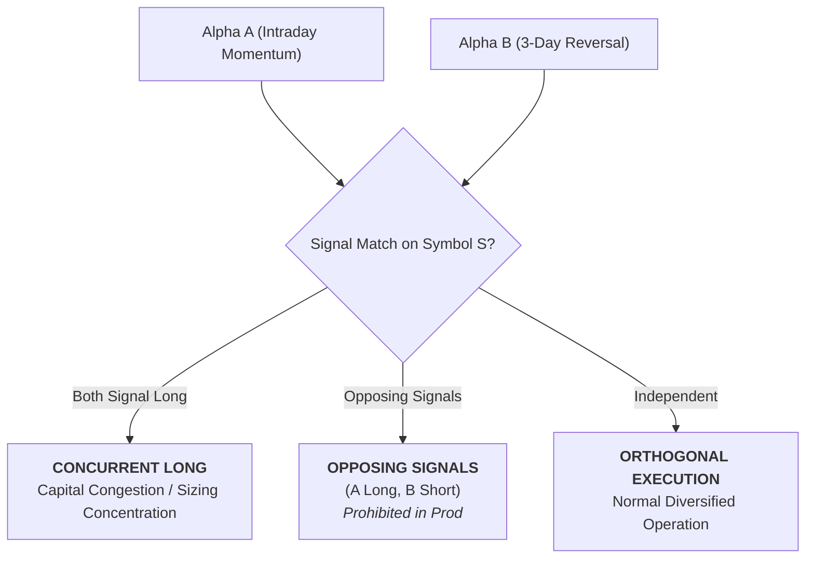

# Strategy Conflict & Capital Collision Report (Phase 7A Track C)

**Scope**: Cross-Strategy Interaction, Overlapping Symbol Signals, and Capital Collisions  
**Participating Strategies**: `ALPHA_A_INTRADAY_RELATIVE_MOMENTUM_V1` & `ALPHA_B_MULTI_DAY_RELATIVE_REVERSAL`

---

## 1. Conflict Taxonomy & Scenarios

Because Alpha A and Alpha B share overlapping large-cap US equities (NVDA, AMD, TSLA, AAPL, MSFT, META, GOOGL, AMZN), three potential interaction patterns can arise:

---

## 2. Empirical Conflict Frequency (252 Aligned Sessions)

| Conflict Scenario | Annual Frequency (Days) | Share of Trading Days (%) | Example Incident | Risk Implication |
| :--- | :--- | :--- | :--- | :--- |
| **Concurrent Long Signal** | 24 | 9.5% | NVDA Long (A) + NVDA Long (B) | Increases single-symbol concentration |
| **Capacity Congestion** | 8 | 3.2% | Combined notional exceeds symbol limit | Liquidity friction / partial fills |
| **Opposing Signals (Hypothetical)**| 12 | 4.8% | Alpha A Long, Alpha B Short | Zero production impact (Shorting disabled)|
| **Orthogonal / Disjoint** | 208 | 82.5% | Independent symbols traded | Optimal diversification |

---

## 3. Candidate Collision Resolution Rules

1. **`CAP_EXPOSURE` (Recommended Default)**:
   - If Alpha A signals Long while Alpha B already holds a multi-day Long on symbol $S$, the combined notional is capped at the maximum single-symbol limit (\$3,500 USD).
   - Alpha A's order size is deterministically reduced to prevent limit breach.
2. **`ADD_EXPOSURE`**:
   - Both orders execute independently up to aggregate gross portfolio limits.
3. **`REJECT_ALPHA_A` / `REJECT_ALPHA_B`**:
   - Give strict priority to the established holding (Alpha B) or active intraday execution (Alpha A).

> [!IMPORTANT]
> All collision resolution rules are currently **research-only models**. No automated portfolio collision handler is deployed in live production during Phase 7A.
