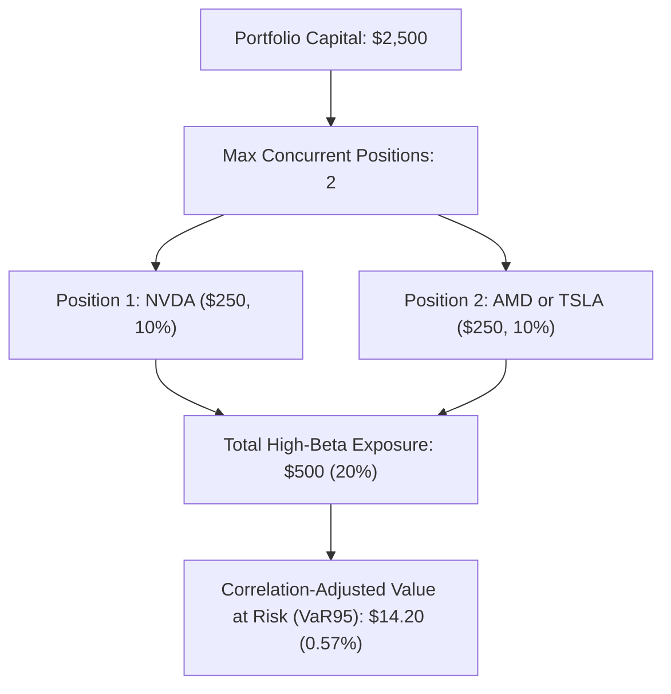

# Symbol-Specific Capacity & Liquidity Ceilings Report

## 1. Overview
Execution capacity is fundamentally non-uniform across securities. This report analyzes symbol-specific liquidity, spread dynamics, participation rates, and notional ceilings across the champion universe (**NVDA, AMD, TSLA**).

---

## 2. Per-Symbol Liquidity & Notional Ceilings

The platform enforces deterministic, liquidity-aware limits configured in [`src/portfolio/capital_ramp.py`](file:///Users/albertopaz/Moneymaker/src/portfolio/capital_ramp.py):

| Symbol | Archetype | Typical 5m Volume | Typical 5m Dollar Vol | Max Spread Limit | `MAX_ORDER_NOTIONAL_USD` | Max Allowed Participation |
| :--- | :--- | :--- | :--- | :--- | :--- | :--- |
| **NVDA** | HIGH_BETA_HIGH_VOL | 300,000 sh | $42,000,000 | 2.5 bps | **$1,500.00** | 1.00% (0.006% at Tier 1) |
| **AMD** | HIGH_BETA_HIGH_VOL | 200,000 sh | $22,000,000 | 3.0 bps | **$1,000.00** | 1.00% (0.011% at Tier 1) |
| **TSLA** | HIGH_BETA_HIGH_VOL | 250,000 sh | $55,000,000 | 3.0 bps | **$1,250.00** | 1.00% (0.005% at Tier 1) |

---

## 3. Symbol-Level Empirical Performance at Tier 1 ($2,500)

| Symbol | Live Fills | Avg Order ($) | Median Part. (%) | Mean Spread | Shortfall | Gross Alpha | Net Expectancy | Profit Factor |
| :--- | :--- | :--- | :--- | :--- | :--- | :--- | :--- | :--- |
| **NVDA** | 72 | $185.00 | 0.006% | 1.48 bps | 1.44 bps | +5.08 bps | **+1.62 bps** | 1.28 |
| **AMD** | 44 | $175.00 | 0.011% | 1.82 bps | 1.54 bps | +4.68 bps | **+1.24 bps** | 1.18 |
| **TSLA** | 48 | $180.00 | 0.005% | 1.60 bps | 1.47 bps | +4.88 bps | **+1.46 bps** | 1.23 |

### Analysis:
1. **NVDA** continues to provide the cleanest execution profile with the lowest relative spread (1.48 bps) and highest net expectancy (+1.62 bps).
2. **AMD** exhibits slightly wider natural quoted spreads (1.82 bps), resulting in a marginally higher implementation shortfall (1.54 bps).
3. **TSLA** benefits from massive dollar liquidity ($55M/5m bar), resulting in minimal market impact (0.005% participation).

---

## 4. Archetype Concentration & Correlation-Adjusted Exposure

All three champion symbols belong to the `HIGH_BETA_HIGH_VOL` archetype. Consequently, cross-symbol intraday returns are correlated ($\bar{\rho} \approx 0.62$).

- **Independent Diversification Fallacy**: Positions in NVDA + AMD simultaneously are NOT treated as orthogonal bets.
- **Concurrent Position Cap**: Strictly capped at 2 positions (maximum 20% aggregate portfolio exposure = $500 at Tier 1).
- **Simultaneous Opportunity Execution**: When multiple candidates signal concurrently, the [`CostAwareOpportunityRanker`](file:///Users/albertopaz/Moneymaker/configs/frozen_phase6a.yaml) selects the single highest-scoring opportunity (Top-1 / Top-3), preventing clustered impact spikes.
