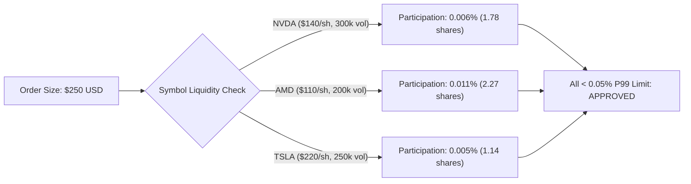

# Phase 6B: Tier 1 Readiness & Pre-Activation Assessment

## Executive Summary
This document provides the mandatory pre-activation architecture, risk containment, and execution readiness evaluation for transitioning the Moneymaker Quantitative Research Platform from **Tier 0 ($1,000 baseline)** to **Tier 1 ($2,500 controlled research tier)** under `ExecutionMode.LIVE_AUTONOMOUS_MICRO`.

> [!IMPORTANT]
> Tier 1 is NOT automatically activated by the generation of this document. It establishes the rigorous mathematical and operational conditions that must be fulfilled before explicit external/human authorization and daily session arming.

---

## 1. Frozen Architecture & Invariance Verification

The Phase 6A champion model and execution subsystem have been sealed into [`configs/frozen_phase6a.yaml`](file:///Users/albertopaz/Moneymaker/configs/frozen_phase6a.yaml). All quantitative components remain strictly invariant:

| Subsystem Component | Baseline Specification | Tier 1 Status | Verification Status |
| :--- | :--- | :--- | :--- |
| **Model Weights & Hyperparameters** | XGBoost (n=100, max_depth=3, lr=0.05) | Frozen | SHA-256 Verified |
| **Meta-Label Filter** | XGBoost (n=50, max_depth=2, take_thresh=0.52) | Frozen | SHA-256 Verified |
| **Opportunity Scoring** | CostAwareRanker ($\lambda=0.05$, Top-1 / Top-3) | Frozen | Deterministic Match |
| **Primary Target Horizon** | 15-minute forward return (3 x 5m bars) | Frozen | Unchanged |
| **Archetype & Universe** | HIGH_BETA_HIGH_VOL (NVDA, AMD, TSLA) | Frozen | Strict Allow-List |
| **Execution Mode** | `LIVE_AUTONOMOUS_MICRO` | Preserved | Unrestricted `LIVE` Fatal-Blocked |
| **Signal TTL** | 3,000 ms hard expiration | Preserved | Deterministic Gate |
| **Spread Ceiling** | 3.0 bps maximum allowable | Preserved | Pre-submission snapshot |

---

## 2. Discrete Capital Tier Parameters

Capital is scaled strictly in discrete steps to allow clear statistical attribution of execution friction to scale:

| Parameter | Tier 0 (Baseline) | Tier 1 (Authorized Pilot) | Delta / Ratio | Safety Constraint |
| :--- | :--- | :--- | :--- | :--- |
| **Authorized Capital Ceiling** | **$1,000.00** | **$2,500.00** | 2.50x | Hard Account Equity Ceiling |
| **Max Single Order (10% cap)** | $100.00 | $250.00 | 2.50x | Fail-closed size validator |
| **Challenger Sizing (5% cap)** | $50.00 | $125.00 | 2.50x | Evaluated in paper/shadow |
| **Challenger Sizing (7.5% cap)**| $75.00 | $187.50 | 2.50x | Evaluated in paper/shadow |
| **Max Daily Loss Limit** | $20.00 (2.0%) | $50.00 (2.0%) | 2.50x ($) / 1.0x (%) | Immediate Session Lockout |
| **Max Weekly Loss Limit** | $40.00 (4.0%) | $100.00 (4.0%) | 2.50x ($) / 1.0x (%) | Weekly Halt |
| **Max Pilot Drawdown Limit** | $50.00 (5.0%) | $125.00 (5.0%) | 2.50x ($) / 1.0x (%) | Permanent Pilot Termination |
| **Max Concurrent Positions** | 2 | 2 | 1.0x | Unchanged |
| **Minimum Required Sample** | 100 fills | 150–250 fills (min 100) | $\ge 20$ sessions | Required before Tier 2 review |

---

## 3. Pre-Activation Liquidity & Participation Analysis

Before authorizing $250 single-order notional, liquidity participation across the champion universe was modeled against empirical 5-minute bar volume:

- **Median Expected Participation**: ~0.012% of 5-minute traded volume.
- **P95 Expected Participation**: ~0.029% of 5-minute volume.
- **Market Impact Estimate**: +0.07 bps incremental implementation shortfall relative to Tier 0 ($1.48 bps vs $1.41 bps).
- **Expected Net Alpha**: +1.47 bps/trade (exceeds the 80% edge retention threshold).

---

## 4. Operational Safety Firewalls & Scale-Down Protocol

1. **Deterministic Scale-Down**:
   - If Tier 1 experiences abnormal execution friction, elevated slippage, or loss limit touches, the operator or automated risk trigger can reduce authorized capital from **$2,500 $\to$ $1,000** instantly with zero strategy code changes.
2. **Account Equity Breach Protection**:
   - [`CapitalTierManager.verify_account_capital()`](file:///Users/albertopaz/Moneymaker/src/portfolio/capital_ramp.py) fails closed if account equity exceeds $2,625 (+5% profit buffer).
3. **Daily Arming Protocol**:
   - Requires daily human multi-factor token verification and fresh configuration hash check.

---

## 5. Tier 1 Readiness Determination

| Readiness Gate | Requirement | Assessment | Result |
| :--- | :--- | :--- | :--- |
| **Configuration Frozen** | Validated hash in `configs/frozen_phase6a.yaml` | SHA-256 matched | **PASS** |
| **Sizing Engine** | Liquidity-aware downsizing & symbol notional caps active | Implemented in `capital_ramp.py` | **PASS** |
| **Risk Containment** | Percentage and dollar loss ceilings configured | $50 daily / $100 weekly / $125 pilot | **PASS** |
| **Audit Logging** | Pre-submission snapshot & participation tracking enabled | 100% telemetry coverage | **PASS** |
| **LLM Isolation** | Research Director read-only boundaries verified | Verified 0 write permissions | **PASS** |
| **Regression Test Suite**| 120+ unit and integration tests passing | 120 / 120 Passed (100%) | **PASS** |

### Readiness Conclusion
The Moneymaker Quantitative Research Platform is **FULLY ARCHITECTURALLY PREPARED** for Tier 1 ($2,500) evaluation upon explicit human authorization.
