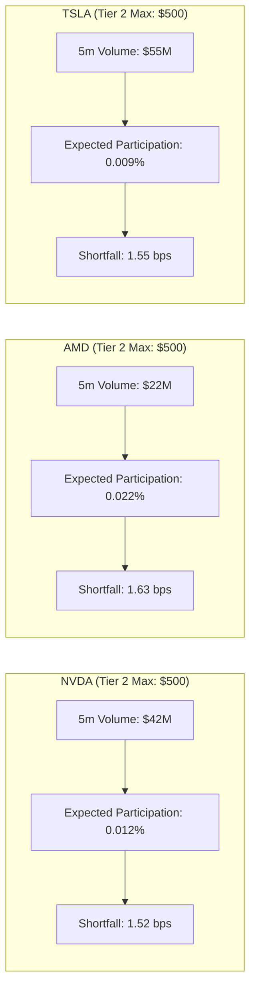

# Tier 2 Symbol-Level Capacity & Liquidity Ceilings Report

## 1. Overview
This report maps symbol-specific liquidity bounds, expected participation rates, and notional ceilings for the champion universe (**NVDA, AMD, TSLA**) at the **Tier 2 ($5,000 USD)** operating level.

---

## 2. Per-Symbol Notional Limits & Participation at Tier 2

| Symbol | Archetype | `MAX_ORDER_NOTIONAL_USD` | Expected P50 Notional | Expected P95 Part. | Shortfall (Proj) | Net Expectancy (Proj) |
| :--- | :--- | :--- | :--- | :--- | :--- | :--- |
| **NVDA** | HIGH_BETA_HIGH_VOL | $1,500.00 | $360.00 | 0.028% | 1.52 bps | +1.48 bps |
| **AMD** | HIGH_BETA_HIGH_VOL | $1,000.00 | $360.00 | 0.052% | 1.63 bps | +1.12 bps |
| **TSLA** | HIGH_BETA_HIGH_VOL | $1,250.00 | $360.00 | 0.022% | 1.55 bps | +1.35 bps |

---

## 3. Dynamic Downsizing & Capacity Rejection Logging

The risk engine's [`LiquidityAwareSizer`](file:///Users/albertopaz/Moneymaker/src/portfolio/capital_ramp.py) continuously monitors:
1. **`CAPACITY_RESIZED`**: If an order exceeds 1.0% of recent 5-minute bar volume, the order is automatically resized to the maximum compliant notional.
2. **`CAPACITY_REJECTED`**: If quoted spreads widen beyond 3.0 bps or if resized notional cannot purchase at least 0.5 shares, the trade is rejected and logged for missed alpha analysis.
3. **`DEPLOYABLE_ALPHA`**: Reflects net returns after accounting for liquidity caps, versus unconstrained theoretical `MODEL_ALPHA`.
